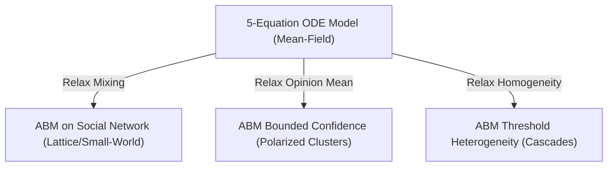

# Model Architecture: ODE vs. Agent-Based Model

This document formalizes the architectural relationship and mathematical link between the deterministic 5-equation system (mean-field model) and the micro-level Agent-Based Model (ABM). 

---

## 1. The Mean-Field Relationship

The 5-equation system implemented in [pendulum_model.py](file:///c:/Users/admir/Github/pendulum/src/pendulum_model.py) represents the **mean-field limit** of the micro-level agent-based model. It describes the aggregate behavior of the system under three simplifying assumptions:

1.  **All-to-All Mixing (Mean-Field Interaction)**:
    In the ODE model, every agent interacts with every other agent uniformly (complete network connectivity). There are no network clusters, geographic silos, or echo chambers. The effective public demand $D_t$ is a single average state.
2.  **Opinion Distribution Summarized by the Mean**:
    The continuous opinion distribution is collapsed to its first moment (the mean). Under Hegselmann-Krause opinion dynamics, if the confidence bounds ($\epsilon$) are wide enough to cover the entire population, the distribution remains unimodal and can be represented by a single average public demand $D_t$ shifting thermostatically.
3.  **Threshold Homogeneity**:
    Individual threshold parameters for backlash mobilization ($\theta_i$) and attention activation ($\theta_{\text{inst},i}$) are assumed to be identical for all agents. The aggregate backlash $B_t$ and attention $A_t$ are therefore governed by sharp, single-valued thresholds ($\theta$ and $\theta_{\text{inst}}$).

---

## 2. Relaxing Assumptions in the ABM

While the ODE simulation tests the deterministic dynamics, the Agent-Based Model in [02_agent_based_model.ipynb](file:///c:/Users/admir/Github/pendulum/notebooks/02_agent_based_model.ipynb) explicitly relaxes these three assumptions one by one to examine real-world deviations:

### A. Network Topology (Relaxing All-to-All Mixing)
Rather than complete mixing, agents are placed on a graph topology (lattice, small-world, or scale-free). 
*   **Implication**: Attention ($A_{t,i}$) and backlash ($B_{t,i}$) propagate locally through network neighbors. Cascades can get trapped in clusters or trigger sudden global tipping points (Granovetter threshold cascades).

### B. Bounded Confidence (Relaxing Opinion Mean Representation)
Agents update their opinions via Hegselmann-Krause dynamics, only adjusting toward neighbors whose opinions lie within their tolerance interval $\epsilon$.
*   **Implication**: Under low tolerance, the population fragments into multiple polarized clusters. The policy $P_t$ ceases to respond to a unified "public opinion," leading to asymmetric backlash loops.

### C. Heterogeneous Thresholds (Relaxing Homogeneity)
Agents are assigned individualized thresholds $\theta_i$ drawn from a distribution (e.g. Normal or Beta).
*   **Implication**: Backlash mobilization is continuous and exhibits path-dependent cascade properties (tipping points) rather than starting abruptly at a single global threshold.
