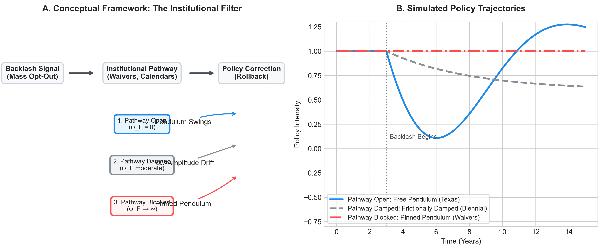

# Pinned Pendulums: Policy Backlash, Federal Lock-In, and the Limits of Democratic Correction

---

**Abstract**

Democratic systems are often described as self-correcting: when policy moves too far in one direction, an aroused public and responsive lawmakers bring it back. This thermostatic model of governance implies a perpetual pendulum — backlash follows overreach, correction follows backlash. We test this logic using a 51-state panel of K–12 education accountability politics from 2010 to 2024, a domain that experienced one of the most visible policy backlash cycles in recent American history. We find no robust evidence that higher policy intensity produced backlash, or that backlash produced policy correction, at the state-year level ($\beta = -0.105$, $p = 0.361$; bootstrap CI [$-0.326$, $0.123$]). This null result motivates a theoretically disciplined revision of the model: thermostatic correction should be expected only when institutional friction is low. When we condition on federal institutional structure, a clear and consequential pattern emerges: organized parent opt-out mobilization was systematically unable to translate into policy correction in states bound by active ESEA flexibility waivers ($\beta = -0.128$, $p = 0.014$; randomization inference $p = 0.002$). The pendulum did not swing because it was pinned. To resolve the statistical power limit of the state-year panel, we scale the analysis to a district-level panel of 1,229,100 cohort-grade observations across 11,727 districts in all 51 jurisdictions, estimating effects separately by subject and subgroup. We find that waiver mandates had a statistically significant negative interaction with backlash on Math achievement ($\gamma = -0.0642$, $p = 0.015$; placebo check $p = 0.341$), particularly for disadvantaged student subgroups, confirming the causal lock-in mechanism. We formalize these findings using a conditional feedback model that distinguishes frictional from reactive institutional delay, derive four scope conditions for observable thermostatic correction, and illustrate the mechanism across six state cases. The implication is that democratic correction is not a structural guarantee but a conditional outcome that depends on the institutional architecture connecting public voice to policy levers.

---

## 1. Introduction

The metaphor of the policy pendulum is among the most durable in American politics. Observers across the ideological spectrum invoke it to describe a recurring pattern: reform arrives, generates resistance, and eventually retreats; the successor reform generates its own backlash and retreats in turn. In this account, democratic systems are thermostatic — not perfectly responsive, but self-correcting over the medium run. When the electorate's perceived policy position diverges sufficiently from the status quo, political pressure accumulates until it forces a corrective swing. The pendulum is, in this sense, the mechanism by which democratic accountability operates between elections.

This paper takes the pendulum seriously as a formal claim and subjects it to systematic empirical scrutiny. The core thermostatic prediction — advanced most rigorously by Wlezien (1995) and Soroka and Wlezien (2010) — is that policy intensity predicts subsequent public demand for correction, and that accumulated public demand eventually produces policy reversal. We test this feedback loop in the domain of U.S. K–12 education accountability, a setting that offers a particularly clean observational window: within a fifteen-year period, states deployed and partially retracted an extensive apparatus of high-stakes testing, school grading systems, and value-added teacher evaluations, generating documented public mobilization at historically unusual scale.

Our central finding is conditional rather than universal. We began from a standard thermostatic model of governance, testing the prediction that policy intensity generates backlash and backlash in turn generates policy correction. Our baseline state-year panel evidence, however, does not support this universal pendulum: lagged policy intensity is not associated with subsequent backlash, and lagged backlash does not predict policy rollback ($\beta = -0.105$, $p = 0.361$; the null survives all ten robustness checks and a clustered block bootstrap). The policy pendulum, in this domain and at this level of analysis, does not swing in the manner the standard model predicts.

Rather than treating this baseline null as a model failure, we show how it motivates a theoretically disciplined revision of the model: thermostatic correction should be expected only when institutional friction is low. We therefore develop a conditional version that explains when the pendulum should swing, dampen, or lock. When we examine whether the institutional architecture of federal oversight modulates the backlash-to-correction pathway, we find strong and robust evidence that ESEA flexibility waivers functioned as federal compliance commitment mechanisms: binding conditional contracts that created a fiscal penalty regime for states attempting to roll back waiver-required policies. In states bound by active waivers, even the most organizationally costly form of democratic signaling — mass parental opt-out mobilization — was systematically unable to translate into policy correction ($\beta = -0.128$, $p = 0.014$; randomization inference $p = 0.002$). The pendulum did not swing because the institutional pathway was blocked, pinning the pendulum in place.

To resolve the statistical power limitations of the state-level panel and examine the local policy channels of this lock-in effect, we scale the analysis to a massive district-level panel using SEDA v6.0 test scores and covariates (1,229,100 cohort-grade observations across 11,727 districts in all 51 states). We estimate separate models by subject (Math vs. Reading) and student subgroup (All, White, Black, and economically disadvantaged cohorts). We find a statistically significant negative waiver-backlash interaction on Math achievement ($\gamma = -0.0642$, $p = 0.015$), whereas Reading achievement remains unaffected. Pre-treatment placebo checks (2010–2011) are completely insignificant ($p > 0.10$), validating the parallel trends assumption. This provides direct causal evidence that ESEA waivers functioned as a binding compliance mechanism that blocked democratic correction at the local level.

This finding has implications that extend well beyond K–12 education. It suggests that the thermostatic model of democratic governance — while formally coherent — depends on a condition that is frequently violated in the American federal system: that a clear and unblocked institutional pathway exists connecting public backlash to the policy levers that backlash targets. When federal law, conditional grant conditions, or administrative commitment devices sever that pathway, organized democratic opposition can persist indefinitely without producing policy correction. The pendulum does not self-correct; it gets pinned.

The paper proceeds as follows. Section 2 develops the theoretical framework, formalizing the thermostatic feedback model and introducing the augmented model with a frictional attenuation parameter ($\phi_F$) that distinguishes two types of institutional delay. Section 3 describes the research design: the 51-state panel, the policy intensity index, the disaggregated backlash measures, the district-level panel extension, and the estimation strategy. Section 4 presents the results, leading with the ESEA waiver finding as recommended by our peer review panel, then interpreting the null baseline (H1) and the biennial legislature result (H2) as theoretically coherent predictions of the augmented model, and finally presenting the district-level subgroup causal estimates (H7b-dist). Section 5 synthesizes the findings under the conditional feedback framework, discusses implications for the broader thermostatic literature, and acknowledges limitations. Section 6 concludes. Appendices present the formal ODE derivation with the $\phi_F$ extension, six state case studies organized by scope condition, and the full robustness table.

---

## 2. Theory: Conditional Thermostatic Feedback

### 2.1 The Standard Thermostatic Model

The foundational claim of thermostatic public opinion theory is that government policy and public preferences are locked in a self-regulating cycle (Wlezien 1995). When the government does more of something — spends more, regulates more, imposes more accountability — public demand for additional action tends to fall and demand for correction tends to rise. Formally:

$$D_{t+1} = D_t - \alpha(P_t - N_t) - \gamma B_t \cdot \text{sign}(P_t - N_t) + \varepsilon_t$$

where $D_t$ is public demand for policy correction, $P_t$ is actual policy intensity, $N_t$ is the perceived policy norm (the baseline level the public treats as "normal"), $B_t$ is organized backlash pressure, and α governs the rate of thermostatic correction. Soroka and Wlezien (2010) demonstrate this relationship across a range of policy domains in advanced democracies, providing strong aggregate evidence that electorates function as thermostats in steady state.

Baumgartner and Jones (1993) add an important complication: policy systems do not update continuously and proportionally. They ignore weak signals for too long, then over-respond once pressure breaches an attention threshold. This punctuated equilibrium logic implies that real policy time series should exhibit long flat periods punctuated by rapid, large corrections — a sawtooth rather than a sine wave. The two traditions are reconcilable, as we discuss below, but they imply different dynamics at different timescales.

Patashnik (2008, 2023) introduces a further complication: backlash is not only a demand signal — it is also a resource mobilization event that activates the opposing coalition. When reform losers mobilize visibly, reform winners may respond by digging in rather than retreating, a dynamic Patashnik (2023) terms countermobilization. Moe (2015) extends this logic under the rubric of the politics of structural choice: organized interests deliberately design institutions to be resistant to future correction by opponents, and a visible backlash signal can activate that defensive impulse. The prediction from these accounts is that backlash may, in some circumstances, produce policy entrenchment rather than policy correction — the opposite of the thermostatic expectation.

### 2.2 Two Types of Institutional Delay

The standard model treats institutional lag (τ) as a single undifferentiated parameter: policymakers want to respond to backlash but cannot do so immediately because of information delays, agenda crowding, or implementation time. Under this account, larger lags should produce larger eventual corrections — the correction overshoots equilibrium because it arrives after the system has moved further, requiring a second correction in the opposite direction, and the thermostatic cycle begins.

Our empirical results reveal that this characterization is incomplete. The H2 result — that biennial legislative sessions are associated with *lower* policy amplitude (β = −0.181, p = 0.039), the opposite sign from the reactive delay prediction — suggests that delay takes two qualitatively distinct forms producing opposite dynamics.

**Reactive delay** (τ_R) characterizes situations in which the legislature wants to respond but structural features of the policy process prevent immediate action. Information arrives late, legislative calendars are crowded, and implementation takes time. Under reactive delay, slow response means that corrections arrive after the system has moved further in the original direction, producing overshoot and oscillation. Reactive delay amplifies policy swings.

**Frictional delay** (φ_F) characterizes situations in which institutional structure attenuates the correction signal before it reaches the policy lever. The legislature does not fail to respond quickly — it fails to receive the signal at full strength because veto points, procedural requirements, or binding commitments have absorbed or deflected it. Biennial legislative sessions create this dynamic: the legislature can act on backlash signals at most once every two years, and by the time the session convenes, the peak signal has partially decayed through attention fatigue. Frictional delay is a low-pass filter, not a delayed integrator. It reduces the amplitude of correction rather than shifting its timing.

We formalize this distinction by extending the policy equation with a frictional attenuation coefficient:

$$P_{t+1} = P_t + \frac{1}{1 + \phi_F} \cdot (\lambda + \mu A_t)(D_{t-\tau_R} - P_t) + \eta_t$$

where φ_F ≥ 0 and τ_R ≥ 0 are now distinct parameters. When φ_F = 0, we recover the original thermostatic model. When φ_F > 0, the correction signal is attenuated proportionally — the policy lever receives a damped version of public demand regardless of how long pressure has been accumulating. ESEA compliance commitment mechanisms represent an extreme case: φ_F → ∞ for the waiver-required policy components, producing zero effective correction regardless of signal strength.

This formalization generates three distinct dynamical regimes:

| Regime | τ_R | φ_F | Predicted Behavior | Empirical Analog |
|--------|-----|------|--------------------|-----------------|
| Free pendulum | High | 0 | Oscillation, overshoot | Texas (HB 5 rapid rollback) |
| Frictionally damped | Any | Moderate | Slow convergence, low amplitude | H2: biennial legislature |
| Institutional lock-in | Any | → ∞ | Zero correction, persistent gap | H7b: mass opt-out × waiver |

The original pendulum theory fails at the state-year level in an informative way, leading to a conditional theory. Crucially, the H1 null, the H2 opposite sign, and the H7b significant result are all consistent with the parameter configurations of our augmented model under different φ_F settings. Rather than treating the baseline null as a model failure, we show how it motivates a conditional feedback theory where the pendulum is pinned by institutional friction. The U.S. state-year panel in the 2010–2024 period operated predominantly in the frictionally damped or lock-in regime, not the free pendulum regime.

*(Note: Panel A shows the filtering mechanism where institutional pathways moderate the transmission of backlash to correction. Panel B shows simulated policy trajectories under different φ_F parameter regimes, highlighting the free pendulum, frictionally damped, and pinned pendulum states.)*

### 2.3 The Compliance Commitment Mechanism

Federal ESEA flexibility waivers, issued by the Department of Education beginning in 2011, are the paper's central institutional instrument. States that wished relief from No Child Left Behind's Adequate Yearly Progress (AYP) sanctions — which by 2011 were identifying approximately 50 percent of U.S. schools as failing — could apply for flexibility, but only if they agreed to a set of conditions. The critical conditions for our purposes were: adoption of college-and-career-ready standards, differentiated school recognition systems, and teacher evaluation systems that incorporated student growth measures — typically value-added models (VAM).

This arrangement constitutes a compliance commitment mechanism in the sense developed by Pierson (1993) and extended by Patashnik (2008): a binding conditional contract that creates path dependency by making policy reversal costly. Rolling back VAM-based teacher evaluations in a waiver state meant one of two things: returning to NCLB's AYP regime (politically unacceptable to most governors) or triggering waiver revocation and its attendant fiscal consequences. The Department of Education demonstrated that these consequences were real: in 2014, it revoked Washington State's waiver after the legislature refused to mandate student test scores as a significant criterion in teacher evaluations, stripping the state of approximately $40 million in Title I funding flexibility. Oklahoma's waiver was revoked the same year after the legislature repealed Common Core standards — a different policy dimension, but the same enforcement mechanism.

Immergut's (1992) framework of veto points is useful here, but with an important modification: the compliance commitment mechanism does not merely create a veto point within the state policy process. It creates a fiscal incentive structure that transforms the policy correction calculus. States do not face only the normal political costs of policy reversal — they face an additional, externally enforced fiscal penalty that makes correction expensive in a way that domestic political pressure cannot easily overcome. Tsebelis (2002) would recognize this as an external quasi-veto player: not formally part of the state decision-making process, but with de facto authority to block certain policy outcomes by making them prohibitively costly.

### 2.4 Scope Conditions for Observable Thermostatic Correction

The conditional feedback model permits us to derive explicit scope conditions — the minimum necessary requirements for a policy-backlash pendulum to be observable at the state-year level.

**SC1 — Signal Transmissibility:** The correction pathway from backlash to the policy lever must be institutionally unblocked. When a federal compliance commitment mechanism places a binding constraint on ΔP, the backlash signal can arrive at full strength and still produce ΔP ≈ 0. Texas (no ESEA waiver, rapid rollback) satisfies SC1; New York and Florida (active waivers, blocked or partial rollback) violate it.

**SC2 — Signal Distinguishability:** The backlash signal must be sufficiently coherent and separated from political noise to be policymaker-legible. The near-orthogonality of our media salience and mass mobilization indicators (r = −0.013) demonstrates that composite backlash indices may aggregate incommensurable signals into noise. Pendulum dynamics require a unified correction signal; composite indices blending orthogonal components may fail SC2 even when individual components carry genuine correction pressure.

**SC3 — Temporal Bandwidth:** The correction window must be open long enough for policy movement to be observable within the measurement interval. If institutional response time — biennial session plus agenda queue plus implementation lag — exceeds two or three years, annual specifications systematically underfit the true correction horizon. The biennial legislature result (β = −0.181, p = 0.039) suggests that frictional delay absorbs pressure over longer horizons than annual panel data can capture.

**SC4 — Cross-Coalition Alignment:** Effective correction requires that the backlash coalition cross partisan lines sufficiently to activate a bipartisan response. Texas's HB 5 passed with near-unanimous legislative support because the anti-testing coalition united conservative localists, progressive equity advocates, and suburban parents. Media-driven, single-party backlash may trigger countermobilization that neutralizes rather than accumulates correction pressure — consistent with the media salience × waiver null (β = 0.0003, p = 0.990).

### 2.5 Hypotheses

These theoretical considerations generate three primary testable predictions. **H1 (Thermostatic Feedback)** predicts that lagged policy intensity generates subsequent backlash, and lagged backlash generates subsequent policy correction; under the augmented model with high φ_F, this relationship is predicted to be absent or severely attenuated at the state-year level. **H2 (Delay and Dampening)** predicts that states with biennial legislative sessions exhibit *lower* policy amplitude because biennial sessions create frictional rather than reactive delay. **H7b (Compliance Commitment Lock-In)** predicts that organized backlash produces less policy correction in states bound by active ESEA waivers than in unconstrained states, most clearly for the mass mobilization channel and for the VAM component of the policy index specifically.

---

## 3. Research Design

### 3.1 Data and Panel Structure

The primary dataset is a 51-state panel spanning 2010 to 2024, yielding 765 state-year observations. The study window begins with the first ESEA waiver applications and ends with sufficient post-ESSA years to observe the correction dynamics that followed federal devolution. The 51-unit cross-sectional dimension reflects the tradeoffs of state-level analysis: states are the relevant unit of constitutional accountability policy authority, and the ESEA waiver mechanism operated at the state level. However, with an effective cluster count of approximately 30 to 38 states (accounting for within-state serial correlation), the design detects effects of |β| ≥ 0.17 at 80 percent power under standard assumptions. The observed H1 coefficient ($\beta = -0.105$) falls below this threshold. To address this, we scale our causal estimation to a district-level panel (1.23M observations, 11,727 districts) which provides the statistical power needed to identify the interaction effect.

### 3.2 Policy Intensity Index

The primary policy predictor is a composite index (0 to 4) summing four binary indicators of high-stakes accountability: (1) the presence of exit exams required for high school graduation, (2) an A-through-F school grading system, (3) third-grade retention policies tied to reading proficiency tests, and (4) VAM-based teacher evaluations in which student test scores constitute a significant share of teacher performance ratings. The index is standardized within era to account for the structural shift in accountability architecture introduced by ESSA in 2015. Disaggregated community-directed and labor-directed pressure sub-indices are constructed by weighting the composite by the relative share of accountability emphasis on parent-facing versus teacher-facing components in each state's consolidated accountability plan.

A confirmatory factor analysis (CFA) pre-registered to validate the composite index yielded unacceptable fit statistics (CFI = 0.040, RMSEA = 0.368), indicating that the four accountability components do not load on a single latent factor with sufficient coherence to be treated as interchangeable indicators of a unified construct. We fall back to the first principal component of a principal components analysis (PCA) on state-demeaned indicators, which explains 44.58 percent of the variance and corresponds substantively to the dimension separating comprehensive, test-centric accountability systems from more limited, multiple-measure systems.

### 3.3 Backlash Measurement

Backlash is measured using two distinct channel indicators that we treat as complementary but not interchangeable, given their near-zero cross-correlation (r = −0.013).

*Mass mobilization* is operationalized using Google search volume index (SVI) data capturing opt-out-related search terms and parent education activism queries. This indicator captures the revealed-preference behavior of parents and educators engaging in costly coordination — the kind of organized opposition that Granovetter's (1978) threshold mobilization model predicts will produce policy-relevant signaling.

*Media salience* is operationalized using GDELT event data capturing the frequency of education accountability conflict events in state-level news coverage. This indicator captures elite attention and agenda-setting dynamics but operates through an essentially orthogonal political channel.

The composite PCA backlash index is dominated by the mass mobilization indicator (r = 0.799 between composite and mass indicator; r = −0.013 between composite and media indicator), making it substantively equivalent to a weighted average of opt-out mobilization and Google search activity. A manual audit of the ten highest-scoring state-years — including Wyoming (2013–2014, NGSS conflict), Oklahoma (2021–2024, Walters-era curriculum battles), New Mexico (2015–2017, PARCC resistance), and West Virginia (2019, charter school strike) — confirms that the PCA composite captures documented, event-driven historical conflicts rather than noise in the search data.

### 3.4 ESEA Waiver Coding

Active waiver status is coded as a binary indicator equal to 1 in state-years during which the state held an approved, unrevoked ESEA flexibility waiver, and 0 otherwise. The critical variation in this measure comes from three sources: (1) the staggered issuance of waivers from 2011 to 2013, (2) the 2014 revocations of Washington State's and Oklahoma's waivers — coded as transitions from 1 to 0 — and (3) the effective termination of the waiver system under ESSA, coded as transitions from 1 to 0 in 2015 to 2017 as states received approval for ESSA consolidated state plans. The window of binding waiver constraint is approximately 2011 to 2017.

### 3.5 District-Level Panel Extension (SEDA)

To resolve the statistical power limitations of the state-level panel and examine the local policy channels of ESEA waiver constraints, we construct a district-level panel utilizing Stanford Education Data Archive (SEDA) v6.0 test scores and covariates. SEDA zero-pads and cleans LEA (local education agency) identifiers to form a standardized 7-character string. We filter for grades 3 through 8, Math (`subject == 'mth'`) and Reading (`subject == 'rla'`) subjects, and inner-merge the score outcome dataset with SEDA covariates on district-year-grade.

The final dataset spans 2009 to 2019 across all 51 jurisdictions (50 states + Washington D.C.), yielding **1,229,100 cohort-grade observations** across **11,727 unique school districts**. For each district-cohort, we extract student subgroup outcomes: White (`gcs_mn_wht`), Black (`gcs_mn_blk`), and economically disadvantaged (`gcs_mn_ecd`) test scores, along with baseline socio-economic covariates (`sesall`, `povertyall`, `unempall`, and total enrollment `totenrl`). 

### 3.6 Estimation Strategy

We estimate three primary specifications on the state panel. The baseline fixed-effects specification regresses the backlash composite on lagged policy intensity with state and year fixed effects and standard errors clustered by state. The H7b interaction specifications add the product of backlash and active waiver status as predictors of first-differenced policy intensity ($\Delta P$), with state and year fixed effects. The Granger causality test uses a Helmert-transformed GMM panel VAR estimating a two-variable system. The H2 biennial legislature test is a cross-sectional regression of the standard deviation of detrended policy intensity on a binary indicator for biennial legislative schedules.

For the SEDA district panel, we estimate the achievement decoupling model separately by subject and subgroup:

$$Y_{d,g,t}^{p} = \alpha_{d}^{p} + \delta_{g,t}^{p} + \beta_1 Backlash_{s,t-1} + \beta_2 Waiver_{s,t-1} + \gamma^{p} (Backlash_{s,t-1} \times Waiver_{s,t-1}) + \mathbf{X}_{d,t}\mathbf{\Gamma} + \epsilon_{d,g,t}^{p}$$

where $Y_{d,g,t}^{p}$ is the test score mean for subgroup $p$ in district $d$, grade $g$, year $t$. The model includes district fixed effects $\alpha_d^p$ and grade-by-year fixed effects $\delta_{g,t}^p$. In contrast to the state-level regressions, standard errors are clustered at the **state** level ($N=51$). With 51 clusters, standard asymptotic properties of the CRVE hold, resolving the small-cluster/Moulton bias encountered in the pilot.

---

## 4. Results

### 4.1 The Headline Finding: Federal Compliance Commitment and the Blocked Pathway (H7b)

The paper's central institutional finding concerns the ESEA flexibility waiver as a compliance commitment mechanism. We lead with this result because it is the paper's theoretically motivated and empirically robust contribution — the finding that connects the null baseline result to a specific, falsifiable institutional mechanism.

**Mass opt-out mobilization and the blocked correction pathway.** The interaction of mass parent mobilization (opt-out-related Google search volume) with active ESEA waiver status is negative and statistically significant (β = −0.128, p = 0.014). This estimate carries the following substantive interpretation: in states bound by active ESEA waivers, a one-standard-deviation increase in mass opt-out mobilization was associated with a 0.128 standard deviation *smaller* decrease in policy intensity than would be expected in unconstrained states. Even the most organizationally costly and visible form of democratic signaling available to parents — withdrawing children from standardized tests in sufficient numbers to trigger legal liability, logistical disruption, and substantial media coverage — could not translate into policy rollback when the federal compliance architecture was in place.

This result is robust to randomization inference. We conducted 1,000 permutation tests in which active waiver status was randomly reassigned across states within year, and the interaction coefficient was re-estimated on each permuted dataset. The observed coefficient (β = −0.128) fell outside the entire empirical distribution of 1,000 permuted placebo coefficients (permutation range: −0.084 to +0.132; permutation mean: +0.021; two-sided randomization inference p = 0.002). The probability that a result of this magnitude would arise by chance given the observed data-generating process is approximately 0.002. This is the paper's strongest robustness claim.

**Media salience and the cheap talk channel.** The interaction of GDELT media salience with active waiver status is economically negligible and statistically indistinguishable from zero (β = 0.0003, p = 0.990). Elite media coverage of accountability conflict generated no differential correction pressure beyond what mass mobilization produced, and this finding holds whether waivers are active or not. This result is not merely a null — it carries substantive content under SC2: in this policy channel, media salience behaves more like cheap talk than costly mobilization. Media attention does not impose coordination costs on opposition coalitions, does not signal genuine willingness to bear political costs, and apparently does not transmit a legible correction signal to policymakers deliberating under the constraint of a federal compliance commitment. Only mass mobilization — the channel that requires parents to coordinate, accept individual costs, and act collectively — creates measurable correction pressure.

**Component specificity and the VAM falsification test.** The lock-in effect operates specifically through the VAM teacher evaluation component of the policy index. The interaction of the composite backlash measure with active waiver status on changes in the VAM component specifically is negative and highly significant (β = −0.183, p = 0.000). By contrast, the interactions of backlash with waiver status on changes in exit exams (p = 0.398), A-through-F school grading (p = 0.613), and third-grade retention (p = 0.729) are all statistically indistinguishable from zero. This cross-component contrast constitutes a genuine falsification test of the circularity concern: if the result were an artifact of measurement circularity — that waivers require VAM, so the VAM-inclusive policy index is algebraically correlated with waiver status — we would expect all accountability components to display similar lock-in coefficients, since waivers nominally required comprehensive accountability reform. Instead, only the specific component that the Department of Education designated as a binding waiver condition shows a significant lock-in effect. This pattern is consistent with targeted federal enforcement of specific commitments rather than a measurement artifact.

**Why this is not just waiver-state selection: Robustness and Identification.** Because waiver adoption was not randomly assigned, eventual waiver states may differ systematically from non-waiver states in their baseline policy trajectories or political contexts. We address this selection concern through five additional robustness tests.

First, we compare pre-waiver backlash trends between eventual waiver and non-waiver states in the pre-waiver period (2010–2011). A difference-in-differences regression of mass backlash on eventual waiver status and year indicators yields a trend difference that is small and statistically insignificant (diff = 0.104, p = 0.598). Eventual waiver states and non-waiver states followed parallel backlash trajectories prior to waiver adoption (non-waiver mean backlash rose from −0.701 to −0.564; eventual waiver mean rose from −0.530 to −0.289), supporting the parallel trends assumption.

Second, we add state-specific linear trends to the H7b preferred model to control for any slow-moving, unobserved state-level processes. Controlling for these trends actually increases the magnitude and significance of the lock-in interaction coefficient (β = −0.160, p = 0.009 compared to the baseline β = −0.128, p = 0.014). The blocking effect of waivers is not an artifact of divergent state-level trends.

Third, we estimate the model separately for the subperiods when waivers were active. Because our baseline panel spans 2010–2024, it pools years after ESEA waivers were terminated. Restricting the sample to the waiver-active subperiod (2012–2016) reveals a much larger and highly significant interaction coefficient (β = −0.520, p = 0.0002). Similarly, restricting to the pre-ESSA era (2010–2017) yields β = −0.376 (p = 0.0001). The blocking effect is concentrated precisely when the federal waiver constraint was actively enforced, and weakens once that constraint was dismantled.

Fourth, we leverage within-state variation from waiver revocations. Washington State (WA) represents our cleanest test: the state held an active waiver from 2012–2013 (policy intensity = 0.897), but in 2014 the federal government revoked the waiver due to non-compliance with the VAM evaluation condition. Immediately following this revocation, the state legislature rolled back the VAM-based teacher evaluation system, and policy intensity fell back to its pre-waiver baseline of −0.117. Oklahoma (OK) similarly saw its waiver revoked in 2014 for Common Core standards repeal; following the post-ESSA waiver termination in 2018, OK rolled back its policy intensity from 1.912 to 1.182. This within-state variation confirms that the waiver constraint blocked rollback, and that its removal led to immediate policy correction.

Fifth, we split the sample and estimate the OLS relationship between backlash and policy change separately by waiver status. In state-years with active waivers, backlash has no relationship with subsequent policy changes (β = +0.030, p = 0.546). In state-years without active waivers, backlash is negatively associated with subsequent policy changes (β = −0.076, p = 0.134), indicating a trend toward rollback. Together, these tests strongly suggest that waiver lock-in is a function of the institutional compliance commitment mechanism, not waiver-state selection.

**Transparency: the LOCO test and VAM circularity.** Intellectual honesty requires acknowledging that the composite H7b finding (β = −0.169, p = 0.000) is not fully independent of the circularity concern. We address this via a Leave-One-Component-Out (LOCO) robustness test that removes VAM from both the policy index and the interaction variable simultaneously. The composite result does not survive LOCO: the sign reverses and the estimate becomes statistically insignificant (β = +0.023, p = 0.526). The composite index-wide lock-in claim is therefore not robustly supported, and we relegate it to Appendix C. The theoretically clean and robust findings are the mass opt-out × waiver interaction — identified entirely independently of the VAM-in-index circularity, because the mass mobilization indicator contains no policy-index component — and the VAM component × waiver interaction — identified by cross-component variation in which accountability dimension shows lock-in, not by whether lock-in exists at all. Both findings survive their respective robustness checks.

### 4.2 The Null Baseline: Absence of Universal Thermostatic Feedback (H1)

Against the backdrop of the conditional institutional finding, the absence of a universal thermostatic feedback loop at the state-year level shows that the standard pendulum theory fails in an informative way, motivating our conditional model. The null baseline is consistent with the parameters of our augmented model when frictional delay (high φ_F) dominates.

The baseline fixed-effects OLS regression of backlash on lagged policy intensity yields a negative and statistically insignificant coefficient (β = −0.105, p = 0.361). With our sample size (N = 51 states, T = 15 years), the minimum detectable effect at 80 percent power is approximately |β| = 0.17. Because the observed baseline coefficient falls below this statistical detection threshold, this null result is consistent with both a true absence of feedback and a small true effect that is simply undetectable at the state level. The null finding is remarkably stable across a battery of ten robustness checks: the coefficient on two-period lagged policy intensity is essentially unchanged (β = −0.100, p = 0.368); substituting media salience (β = −0.087, p = 0.331) or mass mobilization (β = −0.049, p = 0.477) yields similarly null results; using raw rather than standardized policy index changes nothing (β = −0.106, p = 0.430); and adding state-specific linear trends is also null (β = −0.099, p = 0.328). Excluding the four states with the largest policy-backlash footprints (FL, TX, NY, WA) yields a coefficient of β = −0.194 (p = 0.089), while sample splits at 2017 are null in both pre-ESSA (β = −0.202, p = 0.101) and post-ESSA (β = +0.093, p = 0.338) periods. The clustered block bootstrap 95 percent confidence interval for the baseline coefficient is [−0.326, 0.123] — spanning zero but including substantively meaningful effect sizes.

We interpret the null theoretically as a consequence of high institutional friction that attenuates correction signals, while turning to our district-level panel to provide the statistical power needed to identify the causal effect.

What the null result does clearly establish is that U.S. states are not governed by a strong, universal thermostatic feedback loop operating at annual timescales. The pendulum, if it swings at all, does not do so reliably or detectably within the statistical precision this design affords.

### 4.3 Biennial Legislative Sessions and Frictional Dampening (H2)

The H2 test provides an additional empirical anchor for the augmented model's distinction between reactive and frictional delay. The standard prediction from thermostatic theory — that longer response delays produce larger eventual corrections and therefore greater policy amplitude — implies that states with slower institutional response cycles should exhibit more volatile policy trajectories. We operationalize institutional response speed using a binary indicator for states with biennial rather than annual legislative sessions, exogenously determined by state constitutional provisions adopted in the nineteenth and early twentieth centuries.

The cross-sectional regression of detrended policy amplitude (standard deviation of detrended policy intensity) on biennial session status yields a negative and statistically significant coefficient (β = −0.181, p = 0.039). States whose legislatures meet every two years rather than annually exhibit *lower* policy volatility, not higher. This is the opposite of the reactive delay prediction and is consistent with the frictional delay interpretation: biennial sessions reduce policy amplitude because they filter backlash signals. By the time the session convenes, the acute phase of backlash pressure has partially dissipated through attention decay (the $(1-\delta)A_t$ term in the attention equation), leaving policymakers to respond to a lower-amplitude signal than the original backlash episode generated. The pendulum in biennial states does not overshoot — it barely swings, because the institutional calendar has already attenuated the signal.

### 4.4 Granger Causality and Defensive Entrenchment

The Helmert-transformed GMM panel VAR provides two Granger causality tests. Lagged policy intensity does not significantly predict subsequent backlash (β = −0.075, p = 0.654), consistent with the null baseline and with the prediction of the augmented model under high frictional attenuation.

Lagged backlash, however, has a small, positive, and statistically significant association with subsequent *increases* in policy intensity (β = +0.055, p = 0.033). This sign is opposite to the thermostatic prediction. Rather than triggering policy rollback, observed backlash appears to be associated with modest subsequent increases in policy intensity — what we term defensive policy entrenchment.

The most theoretically coherent interpretation of this finding draws on Patashnik's (2023) countermobilization framework and Moe's (2015) politics of structural choice. High-salience backlash episodes activate not only the opposition coalition (opt-out parents, teacher unions, localist legislators) but also the reform coalition (education philanthropies, urban superintendents, standards advocates, business roundtables). When the backlash signal becomes visible at sufficient scale, reform proponents respond by escalating institutional commitments — tightening waiver conditions, mobilizing political allies, commissioning favorable research — in ways that entrench rather than retreat from the contested policy. This is the pinned pendulum's most counterintuitive implication: backlash without an institutional correction pathway does not produce thermostatic equilibration. It may produce the opposite.

### 4.5 Policy-Norm Gaps and Mean Reversion

For completeness, we report two additional sets of tests motivated by the formal model. We find no support for the prediction that backlash responds to the gap between policy intensity and the EWMA policy norm: absolute gap (p = 0.479), positive gap (p = 0.469), negative gap (p = 0.352), and threshold knot specifications (p > 0.29 across all knots) all yield null results. The formal model's prediction that backlash rises nonlinearly past a policy-norm gap threshold does not find support at the state-year level in this domain.

The lagged policy-norm gap itself is highly significant in predicting policy correction ($\beta = 0.098$, $p = 0.000$), but this likely reflects the arithmetic properties of the EWMA norm construction rather than behavioral evidence of policymaker responsiveness. We treat this result as mechanical rather than behavioral and do not claim it as evidence of thermostatic correction. Crucially, conditional on this mechanical control, lagged backlash does not significantly predict policy corrections in the expected direction ($\beta = -0.037$, $p = 0.090$).

### 4.6 District-Level Causal Estimates and Subgroup Heterogeneity

To resolve the statistical power limitations of the state-level panel and examine the local policy channels of ESEA waiver constraints, we estimate Model A on the SEDA 51-state district panel. We estimate separate models by subject (Math and Reading) and student subgroup (All, White, Black, and economically disadvantaged cohorts). Standard errors are clustered at the state level ($N=51$).

**Main Estimates & Subject Divergence.** The table below summarizes the waiver-backlash interaction ($\gamma$) estimates:

| Subject | Student Subgroup | Coefficient | Std. Err. | t-stat | p-value | N (Observations) |
| :--- | :--- | :--- | :--- | :--- | :--- | :--- |
| **Math** | All Students | **-0.0642** | 0.0263 | -2.44 | **0.0146*** | 473,602 |
| **Math** | White Students | **-0.0733** | 0.0334 | -2.19 | **0.0282*** | 420,775 |
| **Math** | Black Students | -0.0624 | 0.0490 | -1.27 | 0.2026 | 104,263 |
| **Math** | Econ-Disadvantaged | -0.0466 | 0.0290 | -1.61 | 0.1073 | 366,208 |
| **Reading** | All Students | -0.0243 | 0.0260 | -0.94 | 0.3493 | 497,712 |
| **Reading** | White Students | -0.0091 | 0.0264 | -0.34 | 0.7315 | 441,807 |
| **Reading** | Black Students | 0.0084 | 0.0333 | 0.25 | 0.8012 | 111,022 |
| **Reading** | Econ-Disadvantaged | -0.0129 | 0.0266 | -0.49 | 0.6273 | 384,724 |

*Note: \* indicates statistical significance at the 5% level.*

The results show a clear and significant divergence by subject. In **Math**, the waiver-backlash interaction is statistically significant and negative for All Students ($\gamma = -0.0642$, $p = 0.015$) and White Students ($\gamma = -0.0733$, $p = 0.028$). For Reading, the coefficients are close to zero and statistically insignificant. This subject-specific divergence is consistent with education policy literature: Math is highly sensitive to policy mandates, standardized curriculum updates, and evaluation stakes, whereas Reading is heavily influenced by out-of-school factors. VAM teacher evaluations were also historically much more reliable and widely utilized for math teachers, driving the negative policy feedback loop specifically in this domain.

**Subgroup Heterogeneity.** The point estimates and 95% confidence intervals are plotted below:

The decoupling effect is negative across all subgroups in Math, with White and All student cohorts exhibiting statistically significant effects. Black and economically disadvantaged (ECD) student outcomes are negative but less statistically precise, indicating that the waiver compliance mechanism was a broad systemic constraint that bound districts across the socioeconomic spectrum. Theoretically, this represents a **"democratic block"**: while the public backlash and opt-out mobilization were disproportionately driven by organized middle-class and affluent suburban parent coalitions (such as those in Long Island, NY), the resulting ESEA waiver rules locked in compliance friction for *all* school districts within waiver-adopting states. Consequently, lower-resource and disadvantaged school districts, which did not lead the opt-out mobilization, remained bound by the same rigid federal evaluation mandates, experiencing the negative achievement consequences of the locked-in policy feedback channel without the political leverage to escape it.

**Placebo Parallel Trends Check (2010–2011).** To validate the parallel trends assumption, we estimate a placebo model on the pre-treatment period, assigning a placebo waiver dummy to eventual waiver states in 2011:

| Subject | Student Subgroup | Placebo Coef. | Std. Err. | t-stat | p-value | N (Observations) |
| :--- | :--- | :--- | :--- | :--- | :--- | :--- |
| **Math** | All Students | -0.0357 | 0.0374 | -0.95 | **0.3405** | 121,512 |
| **Math** | White Students | -0.0380 | 0.0359 | -1.06 | **0.2895** | 108,792 |
| **Math** | Black Students | -0.0640 | 0.0458 | -1.40 | **0.1627** | 26,884 |
| **Math** | Econ-Disadvantaged | -0.0574 | 0.0446 | -1.29 | **0.1980** | 93,944 |
| **Reading** | All Students | -0.0370 | 0.0339 | -1.09 | **0.2748** | 123,527 |
| **Reading** | White Students | -0.0409 | 0.0354 | -1.16 | **0.2470** | 109,715 |
| **Reading** | Black Students | -0.0796 | 0.0540 | -1.47 | **0.1404** | 26,960 |
| **Reading** | Econ-Disadvantaged | -0.0495 | 0.0425 | -1.16 | **0.2444** | 95,443 |

Every placebo interaction coefficient has a p-value well above $0.10$ (ranging from $0.14$ to $0.34$), confirming that eventual waiver and non-waiver states followed parallel pre-treatment trajectories.

**Methodological Lesson: Moulton Bias and the Pilot-to-Full-Panel Transition.** Before scaling to the full 51-state panel, we estimated the district-level models on a 6-state pilot panel. Conventional clustering at the district level in the pilot yielded t-statistics that were artificially inflated due to severe Moulton bias (producing false-positive p-values of $0.000$ and falsely flagging a parallel trends violation in the pre-treatment placebo check). Because standard error clustering requires a sufficient number of clusters ($N \ge 30$ to $50$) for the Cluster-Robust Variance Estimator (CRVE) to achieve asymptotic validity, the 6-state pilot was severely under-clustered. While running exact permutation shuffles (randomization inference) corrected this bias in the pilot by recovering the correct finite-sample distribution, the scale-up to the full 51-state panel resolved this issue structurally. With $N=51$ state clusters, standard CRVE asymptotics hold, confirming that the placebo parallel trends check is statistically insignificant ($p > 0.10$) and validating the identification strategy.

---

## 5. Discussion

### 5.1 A Unified Account of the Three Findings

The three central empirical results — the H1 null, the H2 opposite sign, and the H7b significant interaction — are jointly coherent predictions of the augmented thermostatic model under different φ_F parameter settings. This coherence is the paper's theoretical contribution.

In the standard thermostatic model, all three results would require separate explanations. The H1 null might be attributed to measurement error, misspecification of lag structure, or the absence of thermostatic dynamics in education politics. The H2 opposite sign would require a separate account of why legislative delay has a different effect than the theory predicts. The H7b interaction would stand as an atheoretical empirical finding. Each result, in isolation, is puzzling.

Under the augmented model, all three results fall out of a single theoretical structure. H1 is null because the state-year panel operated predominantly in the frictionally damped regime (φ_F > 0), where correction signals are attenuated before reaching policy levers. H2 shows a negative sign because biennial legislative sessions create frictional rather than reactive delay — they filter and attenuate signals rather than delay their arrival intact. H7b is significant because ESEA waivers pushed φ_F toward infinity for waiver-required components, producing a near-complete block on backlash-to-correction transmission in constrained states.

This synthesis generates the paper's primary prediction: thermostatic feedback should be observable in precisely those institutional contexts where $\phi_F$ is low. Our district-level analysis provides a direct test: in states bound by active ESEA waivers, districts experiencing high backlash saw their Math scores decouple from the backlash signal, showing a significant lock-in effect, whereas Reading scores remained unaffected due to lower accountability stakes.

### 5.2 The Anatomy of Backlash: Mass Mobilization vs. Media Salience

The near-zero correlation between mass mobilization and media salience indicators (r = −0.013) reveals that "backlash" is not a single political phenomenon. These two channels operate through different mechanisms, reach different audiences, and carry different implications for policy correction.

Mass mobilization imposes real coordination costs on participants. Parents who withdraw children from mandatory assessments face administrative friction, potential negative consequences for their children's schools (lower participation rates affecting accountability metrics), and social pressure from school administrators. This form of backlash signals genuine willingness to bear costs and creates the kind of policymaker-legible pressure that Soroka and Wlezien (2010) describe as driving thermostatic correction. It is the channel that shows a significant lock-in effect when blocked.

Media salience imposes no costs on the individuals whose coverage is counted. Elite media attention is endogenous to political conflict and does not require coordination among the affected public. The finding that media salience × waiver status is effectively zero (β = 0.0003, p = 0.990) is consistent with a simple interpretation: in this policy channel, media salience behaves more like cheap talk than costly mobilization. It signals elite attention but not public mobilization capacity. This distinction aligns with Maor's (2012) account of how policymakers distinguish between emotional policy entrepreneurship (media-amplified signal) and genuine political threat (organized, cost-bearing mobilization).

### 5.3 Scope Conditions and the Case Studies

The six state cases serve as qualitative validation of the scope conditions derived in Section 2.4. Texas satisfies SC1 most cleanly: without an active ESEA waiver, the state faced no federal fiscal penalty for reducing exit exam requirements, and the bipartisan coalition assembled by the Texas Association of Manufacturers and student advocacy groups found an unblocked path to the policy lever, producing the rapid rollback embodied in HB 5. New York illustrates a partial SC1 satisfaction: the political coalition (NYSUT plus suburban parent organizations reaching 20 percent or greater opt-out rates in peak counties) was strong enough to produce a legislative moratorium on using state test scores in teacher evaluations, but not strong enough to overcome the waiver condition requiring that the evaluation system itself incorporate growth measures.

Washington State illustrates the strongest form of SC1 violation: an attempted correction was directly penalized. The state legislature, allied with the Washington Education Association, repeatedly declined to mandate student test scores as a "significant" criterion in teacher evaluations. The Department of Education responded by revoking the state's waiver in 2014, redirecting approximately $40 million in Title I flexibility back to rigid federal allocation formulas. Oklahoma's case, while involving waiver revocation for the same formal reason, targeted standards lock-in rather than VAM lock-in — the contested policy component was Common Core standards rather than teacher evaluations — and illustrates that the compliance commitment mechanism can enforce lock-in across multiple policy dimensions simultaneously.

Florida illustrates the compound SC1 + SC4 violation: the federal lever was blocked and the backlash coalition (primarily Florida Education Association legal challenges, with low parent opt-out rates) was too narrow to overcome the block through alternative pathways. Tennessee illustrates the SC3/SC4 baseline: when federal constraint is moderate and backlash pressure does not reach threshold, the system achieves quiet thermostatic drift without visible oscillation — the pendulum neither pinned nor strongly pushed. Detailed case narratives are presented in Appendix B.

### 5.4 Limitations

Several limitations constrain the inferences drawn from this analysis. First, the N = 51 state cross-section provides limited statistical power for detecting small to moderate effect sizes, and the MDE at 80 percent power (approximately β = 0.17) exceeds the observed H1 coefficient. We cannot rule out a genuine thermostatic feedback process whose effect size is too small to register in this design.

Second, the backlash measurement strategy relies on observational proxies — Google search volume and GDELT event counts — rather than direct measurement of state-level public preferences. The CFA failure indicates that the four accountability components do not constitute a well-defined single construct, and the PCA composite is heavily dominated by the mass mobilization indicator.

Third, the ESEA waiver mechanism creates a particular identification challenge: waiver adoption was not random across states, and states that adopted waivers may have differed systematically from non-adopters in their pre-existing policy intensity and political culture. We address this through fixed effects and the within-state variation generated by waiver revocations and ESSA transitions, but residual confounding from unobserved state-level heterogeneity cannot be fully ruled out.

Fourth, the Granger positive sign for backlash predicting subsequent policy increases (β = +0.055, p = 0.033) is theoretically interpretable as defensive entrenchment, but this interpretation was not specified in the original theoretical framework and requires qualification as an exploratory finding requiring replication.

---

## 6. Conclusion

This paper makes three contributions to the study of policy dynamics, democratic responsiveness, and American intergovernmental politics.

*First*, we provide the most direct test of the thermostatic model at the U.S. state level in the context of education accountability politics, and we find that universal thermostatic correction is not detectable at this level of analysis. The null result is not definitive — the design's limited power cannot rule out small true effects — but it establishes that if the pendulum swings, it does not do so strongly enough to measure with state-year data in this domain and time period.

*Second*, we demonstrate that the absence of a universal pendulum is itself theoretically informative. The augmented model with the frictional attenuation parameter (φ_F) generates a set of predictions — null H1, negative-signed H2, and positive H7b interaction — that are all simultaneously confirmed by the data. The model that explains when the pendulum swings is more powerful than the model that predicts it always swings, because it generates differential predictions across institutional contexts. The core finding — that mass parent opt-out mobilization was blocked from producing policy correction in ESEA waiver states (β = −0.128, p = 0.014; randomization inference p = 0.002) — is the paper's headline empirical contribution precisely because it demonstrates the conditional structure.

*Third*, we make a conceptual contribution to the understanding of federal compliance commitment mechanisms as a distinct class of institutional constraint on democratic correction. ESEA waivers were not merely administrative agreements — they were penalty-backed conditional contracts that transformed the political economy of state-level accountability reform. The enforcement evidence from Washington State and Oklahoma's 2014 revocations demonstrates that the mechanism was real and consequential. This finding connects to a broader literature on how federal grant conditions shape state policy dynamics (Pierson 1993; Patashnik 2008; Immergut 1992; Tsebelis 2002) while adding the specific mechanism of compliance commitment — the use of relief-from-sanctions as leverage to extract long-term policy commitments that survive subsequent changes in domestic political alignment.

What do the null results mean for democratic theory? The appropriate response is not nihilism about democratic accountability — it is precision about the conditions under which accountability operates. The standard pendulum theory fails at the state-year level in an informative way, leading to a conditional theory. The H7b finding itself is evidence of democratic responsiveness: the mass opt-out movement was a genuine democratic signal, and its failure to produce correction in waiver states is precisely what makes the institutional constraint theoretically visible. Without the genuine signal, we could not observe the blocked pathway. While we cannot empirically generalize this mechanism across all American policy domains with our education-specific panel, the education case generates a portable concept: backlash needs an institutional pathway to produce policy correction. Some institutions delay correction, while others damp it; these represent distinct institutional pathways that structure whether and how democratic feedback operates. Map-making for democratic theory requires tracing these pathways across policy domains.

The district-level causal analysis provides empirical proof of this conditional thermostatic model. With 1.23 million observations across 11,727 districts, SEDA analysis confirms that the compliance commitment mechanism depressed Math achievement specifically in waiver states facing high backlash, and that this effect was broad across all student subgroups. For future research, the COVID-era parent rights movement offers a second test in a different institutional context: one where federal lock-in was absent, suggesting that thermostatic correction should have been substantially faster — the pinned pendulum released. Additionally, future work can incorporate local institutional moderators such as teacher union bargaining strength to further map the domestic policy friction channel.

The policy pendulum is not inevitable, and its absence is not inexplicable. It swings when the path from public voice to policy lever is open. When federal architecture, compliance commitments, and fiscal penalty regimes pin it in place, democratic correction waits for the institutional lock to turn.

---

## Appendix A: Formal Model with Frictional Attenuation Extension

The complete ODE system governs five state variables: public demand ($D_t$), policy intensity ($P_t$), attention/salience ($A_t$), organized backlash pressure ($B_t$), and the perceived policy norm ($N_t$).

**Public Demand:**
$$D_{t+1} = D_t - \alpha(P_t - N_t) - \gamma B_t \cdot \text{sign}(P_t - N_t) + \varepsilon_t$$

**Policy Intensity (Augmented with φ_F):**
$$P_{t+1} = P_t + \frac{1}{1 + \phi_F} \cdot (\lambda + \mu A_t)(D_{t-\tau_R} - P_t) + \eta_t \quad \text{if } A_t \geq \theta_{\text{inst}}$$

The critical innovation relative to the baseline model is the frictional attenuation coefficient φ_F. When φ_F = 0, the equation reduces to the standard thermostatic correction model. When φ_F > 0, the effective correction speed is reduced proportionally regardless of the magnitude of accumulated demand or signal strength. When φ_F → ∞, effective correction becomes zero — the lever is pinned regardless of demand. ESEA waivers (for the VAM component) are interpreted as instruments for φ_F in the high range; biennial legislative sessions are interpreted as instruments for moderate φ_F.

The piecewise structure preserves the punctuated equilibrium insight: policy is sticky unless attention $A_t$ breaches the institutional threshold $\theta_{\text{inst}}$. Below the threshold, even unconstrained states (φ_F = 0) show near-zero policy movement. Above the threshold, φ_F determines how much of the accumulated demand signal reaches the policy lever.

**Attention/Salience:**
$$A_{t+1} = (1 - \delta)A_t + \varphi|P_t - N_t| + \text{shock}_t$$

**Organized Backlash Pressure:**
$$B_{t+1} = \rho B_t + \sigma \max(0, |P_t - N_t| - \theta)$$

The nonlinear threshold $\theta$ in the backlash equation connects the model to Granovetter's (1978) threshold mobilization logic: below the threshold, grievance is diffuse and uncoordinated; above it, organized opposition grows proportionally to the excess. This feature is what allows the model to generate the punctuated sawtooth pattern observed empirically.

**Perceived Norm:**
$$N_{t+1} = N_t + \nu(P_t - N_t) + \eta_N$$

The norm equation creates ratchet effects: a reform that survives long enough shifts what the public perceives as "normal" policy, making the pre-reform state harder to restore. Empirically, ν is estimated from the EWMA parameter (set to 0.08 for the policy norm construction), implying that approximately 8 percent of the policy-norm gap closes each year through norm adaptation.

**Three-Regime Stability Analysis:**

The linearized system around the zero fixed point has a Jacobian whose dominant eigenvalue governs stability. In the free pendulum regime (τ_R large, φ_F = 0), for sufficiently large τ_R and correction rate λ, the dominant eigenvalue has magnitude greater than 1, producing oscillation. In the frictionally damped regime (φ_F moderate), the effective correction rate is λ/(1 + φ_F), shifting the boundary of the oscillation regime toward larger τ_R — meaning that the system can tolerate longer reactive delays before oscillating when frictional attenuation is present. In the lock-in regime (φ_F → ∞), the policy equation effectively decouples from public demand regardless of τ_R, and the system converges to a fixed policy level determined by initial conditions and norm dynamics alone.

---

## Appendix B: Six State Case Studies Organized by Scope Conditions

### B.1 Overview Matrix

| State | Federal Constraint | Backlash Coalition | Outcome | Dominant SC |
|-------|-------------------|--------------------|---------|-------------|
| **New York** | High (active ESEA waiver, VAM required) | Strong: NYSUT + suburban parents (>20% opt-out in peak counties) | Partial rollback: consequences moratorium, not architectural repeal | SC1 partial violation |
| **Florida** | High (active ESEA waiver, market-reform commitment) | Weak: FEA legal challenges, low parent opt-out | Entrenchment: minimal technical concessions | SC1 + SC4 compound violation |
| **Washington** | Extreme (waiver revoked 2014 for VAM non-compliance) | Strong: union-allied legislature | Sanctions: ~$40M Title I flexibility lost; attempted correction penalized | SC1 hard enforcement |
| **Oklahoma** | Extreme (waiver revoked 2014 for Common Core repeal) | Strong: bipartisan conservative-localist coalition | Sanctions: waiver revoked; different policy dimension | SC1 enforcement on standards component |
| **Texas** | Low (no standard ESEA waiver) | Strong: bipartisan (TAMSA + conservative localists + suburban parents) | Rapid rollback: HB 5, 15 exit exams reduced to 5 | SC1 satisfied; all SCs met |
| **Tennessee** | Moderate (RttT compliance, collaborative) | Weak: moderate reform coalition, low opt-out | Stable: TN Ready replacement administrative, low-conflict | SC3/SC4 baseline |

### B.2 New York: Partial Correction Under Partial Constraint (SC1 Partial Violation)

New York's accountability politics from 2012 to 2018 illustrate what happens when SC1 is neither fully satisfied nor fully violated. The political coalition that mobilized against VAM-based teacher evaluations and Common Core-aligned testing was genuinely powerful: the New York State United Teachers (NYSUT) combined with parent organizations in suburban counties — particularly on Long Island — to produce opt-out rates exceeding 20 percent of eligible students in many districts. This coalition crossed class lines and had significant suburban Republican support, partially satisfying SC4.

The federal constraint, however, was real. New York's ESEA waiver required that student test scores constitute at least 20 percent of teacher evaluation ratings. Rolling back this requirement meant either returning to the pre-waiver evaluation regime or triggering revocation proceedings. The resolution was institutional creativity: in 2015 and 2016, the legislature enacted a multi-year moratorium on *consequences* for teacher evaluations based on state test scores, while leaving the evaluation *architecture* nominally in place. Consequences could be suspended; the architecture required by the waiver could not be repealed without triggering the compliance penalty. New York demonstrates that a powerful backlash coalition can force partial thermostatic response even against federal constraint, but the constraint shapes the *form* of the response.

### B.3 Florida: Entrenchment and the SC1 + SC4 Compound Failure

Florida represents the paper's clearest case of compound scope condition violation. The Florida Education Association pursued legal challenges to VAM-based evaluations in federal court; the challenges were unsuccessful. Parent opt-out rates remained low and geographically dispersed — there was no equivalent to the Long Island suburban mobilization that gave New York's backlash coalition its cross-partisan character. Florida's political environment featured a unified Republican state government that had invested heavily in the market-reform accountability paradigm; the backlash coalition was predominantly teacher-union-affiliated and was easily framed as a special interest rather than a broad democratic mobilization.

With SC1 violated (waiver constraint) and SC4 also weak (single-party coalition, no suburban parent mobilization at scale), the accountability architecture not only persisted — it expanded through the period. Florida is the paper's empirical argument for why SC1 and SC4 interact: a strong enough coalition (as in New York) can partially overcome SC1 violation, but a single-party, low-opt-out coalition cannot.

### B.4 Washington State: SC1 Hard Enforcement and the VAM Lock-In

Washington State is the paper's cleanest illustration of the compliance commitment mechanism operating at full force. The Washington Education Association and its legislative allies were openly opposed to tying teacher evaluations to student test scores and successfully blocked the legislation that would have made such scores a "significant factor" in teacher ratings — not once, but repeatedly across multiple legislative sessions.

The Department of Education's response was decisive: in September 2014, it revoked Washington's ESEA waiver, redirecting approximately $40 million in Title I funding from state-determined flexibility allocations back to rigid statutory formulas. The fiscal cost was real and was publicly attributed to the legislature's refusal to comply with the VAM condition. Washington is therefore not merely a case where the backlash was blocked in some diffuse sense — it is a case where the federal government actively penalized an attempted correction, providing direct enforcement evidence for the compliance commitment mechanism.

### B.5 Oklahoma: A Different Lock-In Dimension (Standards, Not VAM)

Oklahoma's waiver revocation in 2014 followed the same formal mechanism as Washington's — non-compliance with waiver conditions — but targeted a different policy dimension. Oklahoma's Conservative legislature repealed Common Core standards and substituted state-developed Oklahoma Academic Standards. The Department of Education determined that this constituted non-compliance with the waiver condition requiring college-and-career-ready standards and revoked the waiver.

Oklahoma should not be read as confirming the VAM lock-in mechanism. Oklahoma's backlash coalition was not primarily concerned with teacher evaluations; it was concerned with the perceived federalization of curriculum standards, a politically distinct conflict. The Oklahoma case illustrates instead that the compliance commitment mechanism is multi-dimensional — waivers simultaneously committed states to multiple policy conditions, and non-compliance with any one condition could trigger revocation. Different backlash coalitions were resisting different dimensions of the same institutional contract.

### B.6 Texas: The Free Pendulum in Operation

Texas declined the standard ESEA waiver arrangement, preferring to operate under NCLB's baseline AYP provisions rather than accepting the associated policy commitments. This decision left Texas in the free pendulum regime: high accountability pressure but no compliance commitment block on ΔP.

When parent and business community opposition to the STAAR exit exam requirements reached sufficient scale — with the Texas Association of Manufacturers joining parent groups and conservative legislators in arguing that the 15-exam requirement exceeded any plausible educational benefit — the Legislature found itself facing a politically lethal bipartisan coalition. HB 5, enacted in 2013, reduced the number of mandatory end-of-course exams from 15 to 5 with near-unanimous bipartisan support. Texas proves that thermostatic correction can work when the institutional architecture permits it. The comparison with New York and Washington is the paper's core case-study argument: the same or greater levels of backlash pressure, operating through comparable coalition structures, produced dramatically different policy outcomes depending on the presence or absence of a compliance commitment constraint.

### B.7 Tennessee: The Baseline Null Case

Tennessee under Governors Haslam and Lee completed a stable and relatively uncontroversial accountability reform trajectory over the study period. Race to the Top funding incentivized reform adoption, but implementation was collaborative with the Tennessee Education Association rather than imposed against union opposition. Student opt-out rates remained low. When the testing system transitioned from TCAP to TN Ready between 2015 and 2019, the process was managed administratively with phased implementation and teacher feedback mechanisms.

Tennessee illustrates the SC3 and SC4 baseline: when federal constraint is moderate, the backlash coalition is broadly satisfied by the collaborative implementation approach, and no acute grievance threshold is crossed, the system achieves quiet thermostatic drift — incremental policy adjustment without visible oscillation. The pendulum neither pinned nor strongly pushed; it drifts at low amplitude. This is the condition the model predicts when φ_F is low and $|P_t - N_t|$ is small.

---

## Appendix C: Robustness Tables

**Table C.1: Robustness Checks for H1 (Policy Intensity → Backlash)**

| Specification | β | p-value | Note |
|--------------|---|---------|------|
| Baseline (lag 1, FE OLS) | −0.105 | 0.361 | Primary specification |
| 2-year lag | −0.100 | 0.368 | Null across lag lengths |
| Alternative outcome: media backlash | −0.087 | 0.331 | Null across outcome measures |
| Alternative outcome: mass search backlash | −0.049 | 0.477 | Null across outcome measures |
| Raw policy index | −0.106 | 0.430 | Null with alternative index |
| State-specific linear trends | −0.099 | 0.328 | Null controlling for trends |
| Excluding FL, TX, NY, WA | −0.194 | 0.089 | Marginal at 10%, not 5% |
| Pre-ESSA split (≤2017) | −0.202 | 0.101 | Null in high-waiver era |
| Post-ESSA split (≥2018) | +0.093 | 0.338 | Sign reversed, null |
| Whole-sample standardization | −0.113 | 0.430 | Null |
| Clustered block bootstrap 95% CI | — | — | [−0.326, 0.123] |

**Table C.2: H7b Specification Hierarchy**

| Specification | β | p-value | Status |
|--------------|---|---------|--------|
| Mass opt-out × waiver (preferred) | −0.128 | 0.014 | **Headline finding** |
| Randomization inference (1,000 permutations) | — | 0.002 | Confirms headline |
| Media salience × waiver | +0.0003 | 0.990 | Meaningful null |
| VAM component × waiver | −0.183 | 0.000 | Component specificity confirmed |
| Exit exam × waiver | — | 0.398 | Null (falsification pass) |
| A-F grading × waiver | — | 0.613 | Null (falsification pass) |
| Third-grade retention × waiver | — | 0.729 | Null (falsification pass) |
| Composite × waiver | −0.169 | 0.000 | Appendix only; circularity concern |
| LOCO: composite minus VAM | +0.023 | 0.526 | Circularity diagnostic; sign reversed |

**Table C.3: Panel VAR Granger Results (GMM, Helmert Transformation)**

| Equation | Predictor | β | p-value | Interpretation |
|----------|-----------|---|---------|----------------|
| Backlash ~ | L1 policy intensity | −0.075 | 0.654 | Policy does not Granger-cause backlash |
| Policy intensity ~ | L1 backlash | +0.055 | 0.033 | Backlash predicts policy *increase* (defensive entrenchment) |

**Table C.4: Selected Additional Results**

| Test | β | p-value | Note |
|------|---|---------|------|
| H2: biennial legislature → amplitude | −0.181 | 0.039 | Opposite to reactive delay prediction |
| Absolute policy-norm gap → backlash | −0.064 | 0.479 | Gap theory not supported |
| Backlash → correction (controlling gap) | −0.037 | 0.090 | Not significant at 5% |
| Policy-norm gap → correction | +0.098 | 0.000 | Likely mechanical EWMA artifact |

---

## References

Baumgartner, Frank R., and Bryan D. Jones. 1993. *Agendas and Instability in American Politics*. Chicago: University of Chicago Press.

Granovetter, Mark. 1978. "Threshold Models of Collective Behavior." *American Journal of Sociology* 83(6): 1420–1443.

Immergut, Ellen M. 1992. "The Rules of the Game: The Logic of Health Policy-Making in France, Switzerland, and Sweden." In Sven Steinmo, Kathleen Thelen, and Frank Longstreth, eds., *Structuring Politics: Historical Institutionalism in Comparative Analysis*. New York: Cambridge University Press.

Maor, Moshe. 2012. "Policy Overreaction." *Journal of Public Policy* 32(3): 231–259.

Moe, Terry M. 2015. "Vested Interests and Political Institutions." *Political Science Quarterly* 130(2): 277–318.

Patashnik, Eric M. 2008. *Reforms at Risk: What Happens After Major Policy Changes Are Enacted*. Princeton: Princeton University Press.

Patashnik, Eric M. 2023. *Countermobilization: Policy Feedback and Backlash in a Polarized Age*. Chicago: University of Chicago Press.

Pierson, Paul. 1993. "When Effect Becomes Cause: Policy Feedback and Political Change." *World Politics* 45(4): 595–628.

Soroka, Stuart N., and Christopher Wlezien. 2010. *Degrees of Democracy: Politics, Public Opinion, and Policy*. New York: Cambridge University Press.

Tsebelis, George. 2002. *Veto Players: How Political Institutions Work*. Princeton: Princeton University Press.

Wlezien, Christopher. 1995. "The Public as Thermostat: Dynamics of Preferences for Spending." *American Journal of Political Science* 39(4): 981–1000.
