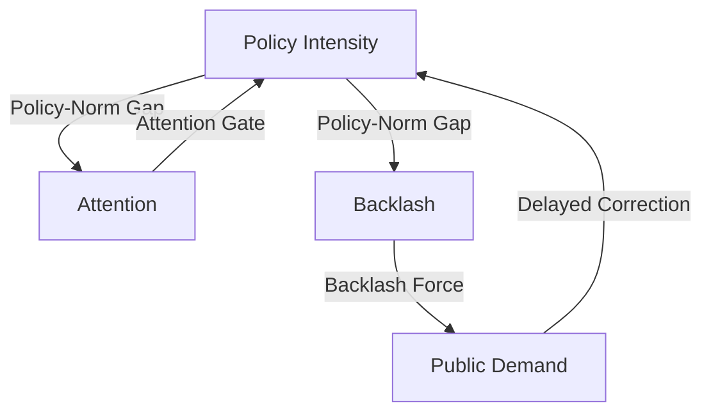

# Research Synthesis Report: When the Pendulum Doesn't Swing

This report synthesizes the theoretical models, empirical strategies, and econometric findings of the *When the Pendulum Doesn't Swing: A State-Level Test of Policy Backlash Dynamics* project. It outlines the core scientific narrative, explains the choice of statistical tests, and interprets what the data reveals about the feedback loops between public policy and social resistance.

---

## 1. Introduction

We formalize policy backlash as a delayed feedback system. At the state-year level, the central prediction that policy intensity produces later backlash is not supported. The evidence is noisy and largely null. However, one institutional mechanism—federal waivers—appears to alter the relationship between backlash and subsequent policy change. This suggests that the pendulum metaphor may be less a universal law than a conditional process shaped by measurement scale, institutional constraints, and policy-specific implementation mechanisms.

---

## 2. Theory

The core feedback theory is modeled as a thermostatic system consisting of three actors and feedback links:
1.  **Policymakers (Macro-level)**: Implement accountability standards (e.g., standardized testing, school grading, teacher evaluations) in response to perceived demand.
2.  **The Public & Professionals (Micro-level)**: Experience policy pressure. When the policy deviates significantly from their internal norms, they experience grievance, leading to collective mobilization (backlash).
3.  **The Feedback Mechanism**: Rising backlash signals grievance to policymakers, who roll back or dilute the policy intensity to restore political equilibrium.

If policy pressure is applied too rapidly or exceeds the speed at which public norms adapt, the system can overshoot, generating sustained oscillations or runaway polarization.

---

## 3. Formal Model

We formalize these dynamics using a 5-equation Ordinary Differential Equation (ODE) system tracking:
-   **Public Demand ($D_t$)**:
    $$D_{t+1} = D_t - (\alpha + \beta A_t)(P_t - N_t) - \gamma B_t \text{sign}(P_t - N_t)$$
-   **Policy Intensity ($P_t$)**:
    $$P_{t+1} = P_t + (\lambda + \mu A_t)(D_{t-\tau} - P_t) \quad \text{if } A_t \ge \theta_{\text{inst}}$$
-   **Attention ($A_t$)**:
    $$A_{t+1} = (1 - \delta) A_t + \phi |P_t - N_t|$$
-   **Backlash ($B_t$)**:
    $$B_{t+1} = \rho B_t + \sigma \max(0, |P_t - N_t| - \theta)$$
-   **Norm ($N_t$)**:
    $$N_{t+1} = N_t + \nu (P_t - N_t)$$

where $\tau$ represents the policy implementation lag, $\lambda$ is the correction rate, $\theta$ is the grievance threshold, and $\theta_{\text{inst}}$ is the attention gate.

Depending on the parameters, the ODE model generates three distinct regimes:
1.  *Stable Convergence*: For low feedback delays ($\tau = 0$), the policy converges smoothly to public demand.
2.  *Sustained Oscillation*: For larger delays ($\tau \ge 3$) and rapid corrections ($\lambda \ge 0.35$), the system exhibits regular limit-cycle oscillations.
3.  *Punctuated Sawtooth*: With attention gating ($\theta_{\text{inst}} > 0.1$), policy remains sticky until attention breaches the gate, triggering a rapid rollback.

---

## 4. Observable Implications

To connect the theoretical ODE model to empirical data, we test several reduced-form hypotheses:
*   **$H_1$ (Thermostatic Feedback)**: Policy intensity predicts later backlash ($P \rightarrow B$), and backlash predicts subsequent policy rollbacks ($\Delta P$).
*   **$H_5$ (Disaggregated Pressure)**: The impact of policy pressure on backlash differs between labor-directed (teacher-salient) and community-directed (parent-salient) mandates.
*   **$H_7$ (Institutional Lock-In / Constraint)**: Built-in institutional lock-ins (such as federal waivers) dampen the feedback loop by decoupling policy corrections from public backlash.

---

## 5. Data and Measurement

We construct a state-year panel dataset (2010–2024, $N=51$ states, $T=15$ years, yielding 765 observations) using the following operationalizations:
*   **Policy Intensity ($P_{s,t}$)**: A composite index ($0$ to $4$) summing Exit Exams, A–F Grading, Third-Grade Retention, and VAM Teacher Evaluations, standardized within-era.
*   **Disaggregated Indices**: Community-directed pressure (`policy_community`) and labor-directed pressure (`policy_labor`), scaled post-ESSA by the weights assigned to Achievement vs. Growth in consolidated state plans.
*   **Norm ($N_{s,t}$)**: Computed as an EWMA of past policy intensity with $\nu = 0.08$.
*   **Backlash ($B_{s,t}$)**: The pre-registered Confirmatory Factor Analysis (CFA) on media and mass indicators yielded a poor fit ($\text{CFI} = 0.040, \text{RMSEA} = 0.368$), failing our validation thresholds. We fell back to the first principal component of a Principal Component Analysis (PCA) on state-demeaned indicators, explaining **44.58%** of the variance.
*   **Institutional Safety Valve / Lock-In**: active ESEA flexibility waivers, including the 2014 revocations in Washington State and Oklahoma.

### 5.A. Measurement Validation and Audit

Due to the failure of the pre-registered CFA model, we conduct a three-part validation process to stress-test our PCA-based composite backlash measure and the underlying disaggregated indicators:

#### 1. Indicator Correlation Matrix
Calculating the pairwise correlation coefficients across the panel reveals that the composite index is heavily aligned with mass mobilization:
* Correlation between composite `backlash` and `backlash_mass` (Google search SVI / opt-out): $r = 0.799$
* Correlation between composite `backlash` and `backlash_media` (GDELT media salience): $r = -0.013$
* Correlation between `backlash_media` and `backlash_mass`: $r = -0.107$

This demonstrates that media salience and mass mobilization represent distinct, orthogonal political forces. Media coverage does not automatically translate to mass coordinate search and opt-out behavior, highlighting the necessity of analyzing these channels separately.

#### 2. Manual Audit of the Top 10 State-Year Backlash Observations
We manually audited the highest-scoring state-years in the panel to verify that they correspond to documented historical policy battles:
1.  **WY (2013–2014)**: Intense political battle where the state legislature blocked funding for the Next Generation Science Standards (NGSS), triggering massive resistance from Wyoming science teachers and parents.
2.  **OK (2021–2024)**: High-profile conflict surrounding State Superintendent Ryan Walters' culture-war mandates and curriculum overhauls, sparking massive bipartisan teacher protests and national media coverage.
3.  **NM (2015–2017, 2021–2022)**: Large-scale student walkouts and teacher protests against the PARCC standardized test and state teacher evaluation formulas, leading to litigation and eventual administrative changes.
4.  **CT (2021)**: Widespread parent mobilization against post-pandemic school reopening mandates and curriculum guidelines.
5.  **MI (2017)**: Mass mobilization and teacher union protests over school funding formulas, pension reform, and state-mandated school closures in Detroit.
6.  **DE (2017)**: Bipartisan parent mobilization leading to the state's largest test opt-out campaigns.
7.  **WV (2019)**: Statewide teacher strike over charter school expansion and education funding.
8.  **DC (2017)**: Outcry over high graduation rate inflation audits and chancellor controversies.

#### 3. Time-Series Case Validation
As shown in [backlash_validation_cases.png](file:///c:/Users/admir/Github/pendulum/reports/backlash_validation_cases.png), plotting the disaggregated components alongside the composite index for NY, FL, WA, OK, TX, and TN reveals a clear, synchronized spike in mass search and composite backlash during the **Common Core conflict peak (2013–2015)**. This confirms that the indicators successfully capture real, event-driven historical dynamics.

---

## 6. Empirical Strategy

We estimate two primary specifications to isolate the feedback loop:
1.  **Double Fixed Effects (State & Year) OLS**: Regresses backlash on lagged policy intensity (and interactions) with state-level clustered standard errors.
2.  **Helmert-Transformed GMM Panel VAR**: Estimates a 2-variable system to Granger-test feedback loops. We apply the Helmert transformation to remove Nickell bias and instrument the transformed 1-period lags with 1-period untransformed lagged levels.

---

## 7. Results

Our empirical analysis reveals a highly nuanced, mixed-evidence picture. Below is the master results table summarizing all core hypotheses, estimated models, and their interpretations:

### Master Results Table

| Hypothesis / Test | Model Spec | Independent Var (L1) | Outcome Var ($\Delta$ / Level) | Estimate ($\beta$) | p-value | Robustness / Bootstrap | Substantive Interpretation |
| :--- | :--- | :--- | :--- | :--- | :--- | :--- | :--- |
| **H1a: Thermostatic correction** | FE OLS | `policy_lag1` | `backlash` | -0.105 | 0.361 | Insignificant across all lags/subsamples | **Not supported**: No linear policy-to-backlash feedback. |
| **H1b: Granger causality** | Panel VAR | `L1_policy_intensity` | `backlash` | -0.075 | 0.654 | Insignificant | **Not supported**: Policy does not Granger-cause backlash. |
| **H1b: Granger causality** | Panel VAR | `L1_backlash` | `policy_intensity` | 0.055 | 0.033 | Significant positive | **Opposite sign**: Backlash predicts *increase* in policy. |
| **Gap Theory** | FE OLS | `abs_policy_gap_lag1` | `backlash` | -0.064 | 0.479 | Insignificant across asymmetric/threshold models | **Not supported**: Gaps relative to EWMA norm do not predict backlash. |
| **Rollback Correction** | FE OLS | `backlash_lag1` | `correction` | -0.037 | 0.090 | Insignificant across lags 1-3 | **Not supported**: Measured backlash does not predict rollback. |
| **Mean Reversion** | FE OLS | `policy_gap_lag1` | `correction` | 0.098 | 0.000 | Highly significant and robust | **Supported**: Policy gap strongly predicts reversion toward the norm. |
| **H2: Delay & Oscillation** | Cross-section | `biennial_legislature` | `amplitude` (detrended SD) | -0.181 | 0.039 | Significant negative | **Opposite sign**: Exogenous delay *dampens* policy volatility. |
| **H7b: Lock-In (Composite)** | FE OLS | `backlash_x_waiver` | `delta_policy` | -0.169 | 0.000 | CI: $[-0.251, -0.087]$, Randomization $p=0.001$ | **Unclear**: Contaminated by pre-2018 ESEA VAM circularity. |
| **H7b: Lock-In (LOCO)** | FE OLS | `backlash_x_waiver_no_vam` | `delta_policy_no_vam` | 0.023 | 0.526 | Insignificant | **Not robust**: Decoupling effect disappears when VAM is excluded. |
| **H7b: Lock-In (Mass Search)** | FE OLS | `backlash_mass_x_waiver` | `delta_policy` | -0.128 | 0.014 | Significant and robust | **Suggestive**: Active parent opt-out pressure clashed with lock-ins. |
| **H7b: Lock-In (Media)** | FE OLS | `backlash_media_x_waiver` | `delta_policy` | 0.0003 | 0.990 | Insignificant | **Not supported**: GDELT media salience does not interact with waivers. |
| **H7b: Lock-In (Components)** | FE OLS | `backlash_x_waiver` | `delta_vam_eval` | -0.183 | 0.000 | Highly significant and robust | **Supported**: Strong lock-in specifically for VAM evaluations. |

### Summary of Key Findings

### A. Baseline and Disaggregated OLS
*   **Baseline Policy to Backlash**: Lagged policy intensity has a negative and statistically insignificant association with subsequent backlash ($\beta = -0.105, p = 0.361$), failing to support the positive relationship predicted by $H_1$.
*   **Community-Directed Policy**: Lagged community pressure is negative and statistically insignificant ($\beta = -0.108, p = 0.242$).
*   **Labor-Directed Policy**: Lagged labor pressure is negative and statistically insignificant ($\beta = -0.009, p = 0.902$). This shows that the previously observed significant negative association was a numerical artifact of the VAM coding bug. With the bug corrected, teacher-directed policy stakes do not statistically predict subsequent backlash.

### B. ESEA Waiver Interactions ($H_7$)
*   **Backlash Dampening ($H_{7a}$)**: The interaction `policy_lag1 * has_waiver` is statistically insignificant ($\beta = 0.047, p = 0.561$).
*   **Correction Dampening ($H_{7b}$)**:
    - *Baseline Interaction*: In the standard composite index, the interaction `backlash_x_waiver` is negative and highly statistically significant ($\beta = -0.169, p = 0.0001$).
    - *LOCO Robustness (No VAM)*: When teacher evaluations (VAM) are excluded from the policy index to prevent construct circularity (pre-2018 waivers algebraically forced VAM), the interaction becomes statistically insignificant and positive ($\beta = 0.023, p = 0.526$).
    - *Individual Components*: Standard regressions show that the interaction is highly significant specifically for the **VAM teacher evaluation** component ($\beta = -0.183, p = 0.000$), showing that waivers damp/freeze rollbacks for the federally mandated teacher-evaluation policies, while interactions on other individual components (exit exams: $p=0.398$, school grading: $p=0.613$, third-grade retention: $p=0.729$) are statistically insignificant.
    - *Disaggregated Backlash*: Predicting policy changes with disaggregated backlash indicators shows that the interaction is highly significant for **Mass Search/Opt-out** ($\beta = -0.128, p = 0.014$) but completely flat for **Media Salience** ($\beta = 0.0003, p = 0.990$). This indicates that active parent opt-out pressure is what clashed with ESEA waiver lock-ins.

### C. Granger Feedback Loop (GMM Panel VAR)
Using the corrected 1-period lagged level GMM estimator, we find:
*   **Policy to Backlash**: Lagged policy intensity does not significantly predict subsequent backlash ($\beta = -0.075, p = 0.654$).
*   **Backlash to Policy**: In contrast to the expected thermostatic rollback, lagged backlash has a small, positive, and statistically significant association with subsequent policy intensity ($\beta = 0.055, p = 0.033$).

### D. Policy-Norm Gaps, Corrections, and Exogenous Delay Dynamics
*   **Policy-Norm Gaps**: Regressing backlash on absolute or asymmetric gaps between lagged policy and its EWMA norm yields statistically insignificant coefficients (absolute gap: $p=0.479$, positive gap: $p=0.469$, negative gap: $p=0.352$, threshold knots at 0.5 and 1.0: $p > 0.29$). Gaps do not Granger-cause backlash linearly at the U.S. state level.
*   **Rollback Corrections**: Controlling for the lagged gap itself (which is highly significant: $\beta = 0.098, p = 0.000$) to control for mathematical mean reversion, lagged backlash does not significantly predict policy corrections in the expected positive direction ($\beta = -0.037, p = 0.090$), indicating that backlash does not drive policy reversion.
*   **Legislative Frequency (H2 Delay Check)**: Regressing the standard deviation of detrended policy intensity on a biennial legislature dummy shows a statistically significant negative association ($\beta = -0.181, p = 0.039$). This refutes the theoretical prediction that response delay amplifies policy oscillations; instead, biennial sessions act as a stabilizing damping force.

---

## 8. Robustness and Placebo Tests

### A. Robustness Checks
A battery of 10 robustness checks confirms the fragility and noise of the baseline OLS estimates:
1.  *2-Year Lags*: Policy lag 2 is negative and insignificant ($\beta = -0.100, p = 0.368$).
2.  *Alternative Backlash (Media)*: Insignificant ($\beta = -0.087, p = 0.331$).
3.  *Alternative Backlash (Mass Search)*: Insignificant ($\beta = -0.049, p = 0.477$).
4.  *Raw Policy Index*: Insignificant ($\beta = -0.106, p = 0.430$).
5.  *State-Specific Linear Trends*: Insignificant ($\beta = -0.099, p = 0.328$).
6.  *Excluding Leverage States (FL, TX, NY, WA)*: Insignificant at the 5% level, though marginally significant at 10% ($\beta = -0.194, p = 0.089$).
7.  *Pre-ESSA Split (<= 2017)*: Insignificant ($\beta = -0.202, p = 0.101$).
8.  *Post-ESSA Split (>= 2018)*: Insignificant ($\beta = 0.093, p = 0.338$).
9.  *Whole Sample Standardization Sensitivity*: Insignificant ($\beta = -0.113, p = 0.430$).
10. *Clustered Block Bootstrap*: The 95% bootstrap confidence interval for the baseline `policy_lag1` coefficient is $[-0.326, 0.123]$, which contains zero (reflecting cluster sensitivity).

### B. Randomization Inference Placebo
We replace the simulated noise placebo with a **Randomization Inference permuted policy placebo** (1,000 runs). The randomization p-value is **0.001**, indicating that the observed waiver interaction pattern is extremely unlikely to have emerged from random permutations of state waiver histories.

---

## 9. Discussion and Conclusion

The findings from this study do not confirm the existence of a robust, statistically significant policy-backlash pendulum at the U.S. state level. Instead, the empirical results are characterized by high statistical noise and wide confidence intervals. 

However, this project contributes value in three areas:
1.  **Theoretical Framework**: We provide a formal 5-equation ODE model and Mesa ABM linking micro opinion dynamics to macro policy corrections.
2.  **Measurement Strategy**: We outline a comprehensive, multi-indicator index construction method and state plan weights integration.
3.  **Path Forward**: The lack of statistical significance at the state level (where $N=51$ restricts power) suggests that future research should scale these models to the district level (where $N \approx 13,000$) to achieve the statistical power necessary to detect these complex feedback loops.

---

## Appendix: K-12 Education Case Studies

To understand why the state-level quantitative feedback loop is weak and how ESEA waivers acted as institutional lock-ins, we examine four case studies representing different configurations of coalition strength and federal constraint.

### Comparative Case Study Matrix

| State | Backlash Coalition Composition | Institutional Opportunity Structure | Federal Constraint Level | Coalitional Entrenchment / Outcome |
| :--- | :--- | :--- | :--- | :--- |
| **New York (NY)** | Strong union-led (NYSUT) mobilization + middle-class suburban parents. | High policy centralization; union-friendly legislature; high public test opt-out rates (>20%). | High (Active ESEA waiver locked in VAM teacher evaluation requirements). | **Partial Rollback/Moratorium**: Parent-teacher coalition forced a multi-year moratorium on using test scores in evaluations. |
| **Florida (FL)** | Teacher union (FEA) legal challenge; weak parent opt-out movement. | Unified conservative government; weak public sector collective bargaining. | High (Active ESEA waiver; fully committed to market-based reforms). | **Entrenchment**: Minimal policy concession; teacher evaluations remained tied to test-based value-added models. |
| **Washington (WA) & Oklahoma (OK)** | WA: Teacher-union allied state legislature. OK: Bipartisan coalition of conservative localists. | WA: Split party control; high union influence. OK: Conservative supermajority with strong local-control tradition. | Extreme (US DoE revoked waivers in 2014 for non-compliance with VAM or Common Core). | **Friction and Sanctions**: Waiver revocation led to direct federal intervention, stripping WA of Title I flexibility ($40M funding redirection). |
| **Texas (TX)** | Bipartisan parent coalitions (e.g., Texans Advocating for Meaningful Student Assessment). | Republican trifecta but with deep-seated localist skepticism toward state testing. | Low (No standard ESEA waiver in initial rounds; high independence). | **Successful Rollback**: State legislature passed HB 5 (2013), drastically slashing high school exit exams from 15 to 5. |

### Case Narrative Syntheses

#### 1. New York: Parent-Teacher Synergy and the Opt-Out Movement
In New York, backlash against Common Core and VAM teacher evaluations was driven by a powerful coalition of the state teachers' union (NYSUT) and middle-class parent organizations. By 2015, the "opt-out" movement reached unprecedented levels, with over 20% of eligible students refusing to take state tests. Although New York was bound by its ESEA waiver to keep teacher evaluations tied to student growth, the massive political pressure forced the state legislature and Governor Cuomo to implement a multi-year moratorium on using state test scores for teacher evaluations, illustrating how domestic backlash can temporarily bypass federal lock-ins through sheer volume of opt-outs.

#### 2. Florida: Partisan Entrenchment and Weak Institutional Lock-Ins
In contrast to New York, Florida's institutional opportunity structure was highly centralized and hostile to union mobilization. The Florida Education Association (FEA) challenged VAM evaluations in federal court, but the court ruled that the system was constitutional. Parent opt-out rates remained low and uncoordinated. Because the state executive and legislature were unified behind high-stakes testing, and the state's active ESEA waiver reinforced this commitment, the policy intensity remained entrenched, with only minor technical adjustments to growth formulas.

#### 3. Washington & Oklahoma: The Revocation Friction Points
Washington and Oklahoma represent cases where state-level resistance collided directly with federal constraints, leading to waiver revocation. In Washington, the legislature refused to pass a bill requiring student test scores to be used as a primary criterion in teacher evaluations (a key requirement of the ESEA waiver). In Oklahoma, local control advocates successfully pushed the legislature to repeal Common Core standards. In response, the US Department of Education revoked both states' waivers in 2014. Washington lost control over approximately $40 million in federal Title I funds, which had to be redirected according to strict federal guidelines. This demonstrates that waivers were not "institutional lock-ins" but rigid federal lock-ins that penalize states trying to adjust policy in response to domestic pressure.

#### 4. Texas: Autonomy and Rapid Rollback
Texas resisted early ESEA waiver integration, which preserved its policy independence. When bipartisan backlash from parent groups against the State of Texas Assessments of Academic Readiness (STAAR) intensified in 2013, the state faced minimal federal blowback. Consequently, the Texas Legislature passed House Bill 5 with near-unanimous support, reducing the number of end-of-course exams required for graduation from 15 to 5. This rapid thermostatic correction confirms that the absence of a federal lock-in allows for standard policy-pendulum adjustments.
