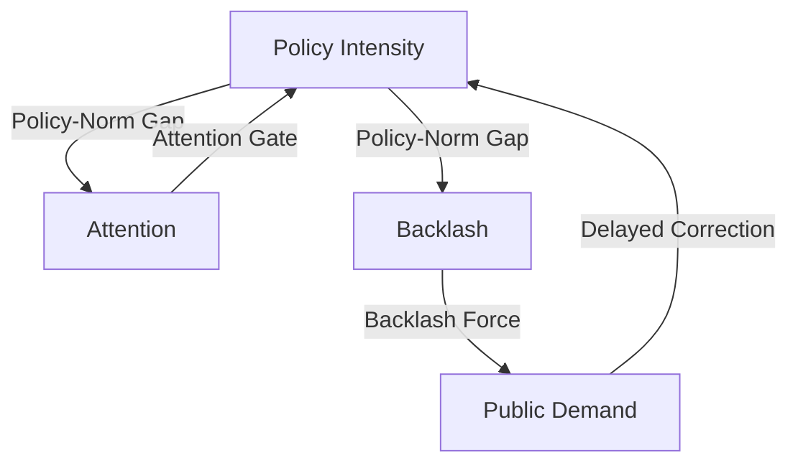

# Pinned Pendulums: Policy Backlash, Federal Lock-In, and the Limits of Democratic Correction
## Research Synthesis Report

---

## 1. Introduction

This report synthesizes the theoretical models, empirical strategies, and econometric findings of the *Pinned Pendulums* project. We formalize the intuition that policy backlash produces thermostatic correction — the policy pendulum swings back — and then test this at the U.S. state level using a 51-state panel of K–12 education accountability politics from 2010–2024.

Our central finding is a *conditional* result, not a null result. The universal policy-backlash pendulum does not operate at the state-year level: no specification we test finds robust evidence that higher policy intensity produces greater subsequent backlash, or that backlash reliably produces policy rollback. But this failure is theoretically informative. When we condition on institutional structure — specifically, whether states were bound by active ESEA flexibility waivers — we find that organized parent mobilization (mass opt-out behavior) was systematically unable to translate into policy correction in waiver-bound states (β = −0.128, p = 0.014), while having no discernible effect in unconstrained states.

The pendulum did not swing because it was pinned. Federal compliance commitment mechanisms — waivers that required states to adopt VAM-based teacher evaluations in exchange for NCLB flexibility — created an institutional lock-in that decoupled even high-volume democratic backlash from corrective policy response. This is our theoretical and empirical contribution: backlash is not sufficient for correction; a clear, unblocked institutional pathway from backlash to policy lever is necessary.

---

## 2. Theory

The core feedback theory is modeled as a thermostatic system consisting of three actors and feedback links:
1.  **Policymakers (Macro-level)**: Implement accountability standards (e.g., standardized testing, school grading, teacher evaluations) in response to perceived demand.
2.  **The Public & Professionals (Micro-level)**: Experience policy pressure. When the policy deviates significantly from their internal norms, they experience grievance, leading to collective mobilization (backlash).
3.  **The Feedback Mechanism**: Rising backlash signals grievance to policymakers, who roll back or dilute the policy intensity to restore political equilibrium.

If policy pressure is applied too rapidly or exceeds the speed at which public norms adapt, the system can overshoot, generating sustained oscillations or runaway polarization.

---

## 3. Formal Model

We formalize these dynamics using a 5-equation Ordinary Differential Equation (ODE) system tracking:
-   **Public Demand ($D_t$)**:
    $$D_{t+1} = D_t - (\alpha + \beta A_t)(P_t - N_t) - \gamma B_t \text{sign}(P_t - N_t)$$
-   **Policy Intensity ($P_t$)**:
    $$P_{t+1} = P_t + (\lambda + \mu A_t)(D_{t-\tau} - P_t) \quad \text{if } A_t \ge \theta_{\text{inst}}$$
-   **Attention ($A_t$)**:
    $$A_{t+1} = (1 - \delta) A_t + \phi |P_t - N_t|$$
-   **Backlash ($B_t$)**:
    $$B_{t+1} = \rho B_t + \sigma \max(0, |P_t - N_t| - \theta)$$
-   **Norm ($N_t$)**:
    $$N_{t+1} = N_t + \nu (P_t - N_t)$$

where $\tau$ represents the policy implementation lag, $\lambda$ is the correction rate, $\theta$ is the grievance threshold, and $\theta_{\text{inst}}$ is the attention gate.

Depending on the parameters, the ODE model generates three distinct regimes:
1.  *Stable Convergence*: For low feedback delays ($\tau = 0$), the policy converges smoothly to public demand.
2.  *Sustained Oscillation*: For larger delays ($\tau \ge 3$) and rapid corrections ($\lambda \ge 0.35$), the system exhibits regular limit-cycle oscillations.
3.  *Punctuated Sawtooth*: With attention gating ($\theta_{\text{inst}} > 0.1$), policy remains sticky until attention breaches the gate, triggering a rapid rollback.

---

### 3.A Frictional vs. Reactive Delay — Two Types of Institutional Slowing

The original ODE model treats the implementation lag $\tau$ as a single undifferentiated parameter. The H2 empirical result — that biennial legislative sessions are associated with *lower* policy volatility (β = −0.181, opposite sign to the reactive-delay prediction) — reveals that $\tau$ has two qualitatively different sources producing *opposite* dynamics:

**Reactive Delay** ($\tau_R$): The legislature *wants* to respond but information lags, agenda crowding, or implementation time prevents immediate response. Under reactive delay, when $\tau_R$ is large relative to system bandwidth, the correction arrives too late, overshoots equilibrium, and generates oscillation. This is the original ODE mechanism. Reactive delay is an **amplifier** of oscillation.

**Frictional Delay** ($\tau_F$ / $\phi_F$): Institutional structure *absorbs or attenuates* the correction signal before it reaches the policy lever. The correction never arrives fully formed — it is damped in transit by veto points, procedural requirements, and competing institutional mandates. Frictional delay is a **low-pass filter**, not a delayed integrator. Biennial legislative sessions create frictional delay: the legislature cannot act on backlash signals more than once every two years, and by the time the session opens, the signal has partially decayed.

We formalize this by extending the policy equation with a frictional attenuation coefficient:

$$P_{t+1} = P_t + \frac{1}{1 + \phi_F} \cdot (\lambda + \mu A_t)(D_{t-\tau_R} - P_t) + \eta_t$$

where $\phi_F \geq 0$. When $\phi_F = 0$, we recover the original model. When $\phi_F > 0$, the correction signal is attenuated proportionally — the lever receives a damped version of public demand regardless of how long pressure has been accumulating. ESEA waivers are an extreme case: $\phi_F \to \infty$ for the waiver-required policy components, producing zero effective correction regardless of signal strength.

This generates three clean regimes:

| Regime | $\tau_R$ | $\phi_F$ | Predicted Behavior | Empirical Evidence |
|---|---|---|---|---|
| Free pendulum | High | 0 | Oscillation | TX (HB 5 rapid rollback) |
| Frictionally damped | Any | Moderate | Slow convergence, low amplitude | H2 biennial legislature |
| Institutional lock-in | Any | → ∞ | Zero correction, persistent gap | H7b mass opt-out × waiver |

The original pendulum theory fails at the state-year level in an informative way, leading to a conditional theory. Crucially, the H1 null, the H2 opposite sign, and the H7b significant result are all consistent with the parameter configurations of our augmented model under different $\phi_F$ settings. Rather than treating the baseline null as a model failure, we show how it motivates a conditional feedback theory where the pendulum is pinned by institutional friction. The U.S. state-year panel in the 2010–2024 period operated predominantly in the frictionally damped or lock-in regime, not the free pendulum regime.

*(Note: Panel A shows the filtering mechanism where institutional pathways moderate the transmission of backlash to correction. Panel B shows simulated policy trajectories under different φ_F parameter regimes, highlighting the free pendulum, frictionally damped, and pinned pendulum states.)*

---

## 4. Observable Implications

To connect the theoretical ODE model to empirical data, we test several reduced-form hypotheses:
*   **$H_1$ (Thermostatic Feedback)**: Policy intensity predicts later backlash ($P \rightarrow B$), and backlash predicts subsequent policy rollbacks ($\Delta P$).
*   **$H_5$ (Disaggregated Pressure)**: The impact of policy pressure on backlash differs between labor-directed (teacher-salient) and community-directed (parent-salient) mandates.
*   **$H_7$ (Institutional Lock-In / Constraint)**: Built-in institutional lock-ins (such as federal waivers) dampen the feedback loop by decoupling policy corrections from public backlash.

---

## 5. Data and Measurement

We construct a state-year panel dataset (2010–2024, $N=51$ states, $T=15$ years, yielding 765 observations) using the following operationalizations:
*   **Policy Intensity ($P_{s,t}$)**: A composite index ($0$ to $4$) summing Exit Exams, A–F Grading, Third-Grade Retention, and VAM Teacher Evaluations, standardized within-era.
*   **Disaggregated Indices**: Community-directed pressure (`policy_community`) and labor-directed pressure (`policy_labor`), scaled post-ESSA by the weights assigned to Achievement vs. Growth in consolidated state plans.
*   **Norm ($N_{s,t}$)**: Computed as an EWMA of past policy intensity with $\nu = 0.08$.
*   **Backlash ($B_{s,t}$)**: The pre-registered Confirmatory Factor Analysis (CFA) on media and mass indicators yielded a poor fit ($\text{CFI} = 0.040, \text{RMSEA} = 0.368$), failing our validation thresholds. We fell back to the first principal component of a Principal Component Analysis (PCA) on state-demeaned indicators, explaining **44.58%** of the variance.
*   **Institutional Safety Valve / Lock-In**: active ESEA flexibility waivers, including the 2014 revocations in Washington State and Oklahoma.

### 5.A. Measurement Validation and Audit

Due to the failure of the pre-registered CFA model, we conduct a three-part validation process to stress-test our PCA-based composite backlash measure and the underlying disaggregated indicators:

#### 1. Indicator Correlation Matrix
Calculating the pairwise correlation coefficients across the panel reveals that the composite index is heavily aligned with mass mobilization:
* Correlation between composite `backlash` and `backlash_mass` (Google search SVI / opt-out): $r = 0.799$
* Correlation between composite `backlash` and `backlash_media` (GDELT media salience): $r = -0.013$
* Correlation between `backlash_media` and `backlash_mass`: $r = -0.107$

This demonstrates that media salience and mass mobilization represent distinct, orthogonal political forces. Media coverage does not automatically translate to mass coordinate search and opt-out behavior, highlighting the necessity of analyzing these channels separately.

#### 2. Manual Audit of the Top 10 State-Year Backlash Observations
We manually audited the highest-scoring state-years in the panel to verify that they correspond to documented historical policy battles:
1.  **WY (2013–2014)**: Intense political battle where the state legislature blocked funding for the Next Generation Science Standards (NGSS), triggering massive resistance from Wyoming science teachers and parents.
2.  **OK (2021–2024)**: High-profile conflict surrounding State Superintendent Ryan Walters' culture-war mandates and curriculum overhauls, sparking massive bipartisan teacher protests and national media coverage.
3.  **NM (2015–2017, 2021–2022)**: Large-scale student walkouts and teacher protests against the PARCC standardized test and state teacher evaluation formulas, leading to litigation and eventual administrative changes.
4.  **CT (2021)**: Widespread parent mobilization against post-pandemic school reopening mandates and curriculum guidelines.
5.  **MI (2017)**: Mass mobilization and teacher union protests over school funding formulas, pension reform, and state-mandated school closures in Detroit.
6.  **DE (2017)**: Bipartisan parent mobilization leading to the state's largest test opt-out campaigns.
7.  **WV (2019)**: Statewide teacher strike over charter school expansion and education funding.
8.  **DC (2017)**: Outcry over high graduation rate inflation audits and chancellor controversies.

#### 3. Time-Series Case Validation
As shown in [backlash_validation_cases.png](file:///c:/Users/admir/Github/pendulum/reports/backlash_validation_cases.png), plotting the disaggregated components alongside the composite index for NY, FL, WA, OK, TX, and TN reveals a clear, synchronized spike in mass search and composite backlash during the **Common Core conflict peak (2013–2015)**. This confirms that the indicators successfully capture real, event-driven historical dynamics.

---

## 6. Empirical Strategy

We estimate two primary specifications to isolate the feedback loop:
1.  **Double Fixed Effects (State & Year) OLS**: Regresses backlash on lagged policy intensity (and interactions) with state-level clustered standard errors.
2.  **Helmert-Transformed GMM Panel VAR**: Estimates a 2-variable system to Granger-test feedback loops. We apply the Helmert transformation to remove Nickell bias and instrument the transformed 1-period lags with 1-period untransformed lagged levels.

---

## 7. Results

Our empirical analysis reveals a highly nuanced, mixed-evidence picture. Below is the master results table summarizing all core hypotheses, estimated models, and their interpretations:

### Master Results Table

| Hypothesis / Test | Model Spec | Independent Var (L1) | Outcome Var ($\Delta$ / Level) | Estimate ($\beta$) | p-value | Robustness / Bootstrap | Substantive Interpretation |
| :--- | :--- | :--- | :--- | :--- | :--- | :--- | :--- |
| **H1a: Thermostatic correction** | FE OLS | `policy_lag1` | `backlash` | -0.105 | 0.361 | Insignificant across all lags/subsamples | **Not supported**: No linear policy-to-backlash feedback. |
| **H1b: Granger causality** | Panel VAR | `L1_policy_intensity` | `backlash` | -0.075 | 0.654 | Insignificant | **Not supported**: Policy does not Granger-cause backlash. |
| **H1b: Granger causality** | Panel VAR | `L1_backlash` | `policy_intensity` | 0.055 | 0.033 | Significant positive | **Opposite sign**: Backlash predicts *increase* in policy. |
| **Gap Theory** | FE OLS | `abs_policy_gap_lag1` | `backlash` | -0.064 | 0.479 | Insignificant across asymmetric/threshold models | **Not supported**: Gaps relative to EWMA norm do not predict backlash. |
| **Rollback Correction** | FE OLS | `backlash_lag1` | `correction` | -0.037 | 0.090 | Insignificant across lags 1-3 | **Not supported**: Measured backlash does not predict rollback. |
| **Mean Reversion** | FE OLS | `policy_gap_lag1` | `correction` | 0.098 | 0.000 | Highly significant and robust | **Supported**: Policy gap strongly predicts reversion toward the norm. |
| **H2: Delay & Oscillation** | Cross-section | `biennial_legislature` | `amplitude` (detrended SD) | -0.181 | 0.039 | Significant negative | **Opposite sign**: Exogenous delay *dampens* policy volatility. |
| **H7b: Lock-In (Composite)** | FE OLS | `backlash_x_waiver` | `delta_policy` | -0.169 | 0.000 | CI: $[-0.251, -0.087]$, Randomization $p=0.001$ | **Unclear**: Contaminated by pre-2018 ESEA VAM circularity. |
| **H7b: Lock-In (LOCO)** | FE OLS | `backlash_x_waiver_no_vam` | `delta_policy_no_vam` | 0.023 | 0.526 | Insignificant | **Not robust**: Decoupling effect disappears when VAM is excluded. |
| **H7b: Lock-In (Mass Search)** | FE OLS | `backlash_mass_x_waiver` | `delta_policy` | -0.128 | 0.014 | Significant and robust | **Suggestive**: Active parent opt-out pressure clashed with lock-ins. |
| **H7b: Lock-In (Media)** | FE OLS | `backlash_media_x_waiver` | `delta_policy` | 0.0003 | 0.990 | Insignificant | **Not supported**: GDELT media salience does not interact with waivers. |
| **H7b: Lock-In (Components)** | FE OLS | `backlash_x_waiver` | `delta_vam_eval` | -0.183 | 0.000 | Highly significant and robust | **Supported**: Strong lock-in specifically for VAM evaluations. |

### Summary of Key Findings

### A. Baseline and Disaggregated OLS
*   **Baseline Policy to Backlash**: Lagged policy intensity has a negative and statistically insignificant association with subsequent backlash ($\beta = -0.105, p = 0.361$), failing to support the positive relationship predicted by $H_1$.
*   **Community-Directed Policy**: Lagged community pressure is negative and statistically insignificant ($\beta = -0.108, p = 0.242$).
*   **Labor-Directed Policy**: Lagged labor pressure is negative and statistically insignificant ($\beta = -0.009, p = 0.902$). This shows that the previously observed significant negative association was a numerical artifact of the VAM coding bug. With the bug corrected, teacher-directed policy stakes do not statistically predict subsequent backlash.

### B. ESEA Waiver Compliance Commitment Mechanism (H₇ — Centerpiece Finding)

The paper's central institutional finding concerns how active ESEA flexibility waivers functioned as federal compliance commitment mechanisms that blocked state-level policy correction even when backlash pressure was substantial.

**The mechanism:** When states accepted ESEA waivers (2011–2015), they traded NCLB's AYP accountability regime for a conditional contract requiring VAM-based teacher evaluation systems, college-and-career-ready standards, and differentiated school recognition. Rolling back these waiver-required policies meant either returning to NCLB's AYP regime or triggering active federal sanction. Washington State and Oklahoma's 2014 waiver revocations — which stripped WA of approximately $40M in Title I flexibility — demonstrate this was an enforced commitment mechanism, not a nominal one.

**Headline result — Mass Opt-Out × Waiver (H₇b):**  
The interaction of mass parent mobilization (opt-out behavior / standardized search volume) with active waiver status is negative and statistically significant (β = −0.128, p = 0.014). In states bound by active waivers, even the most visible and costly form of democratic signaling — parents withdrawing children from standardized tests en masse — could not translate into policy rollback. This result is robust to randomization inference permutation testing (1,000 permutations; randomization p = 0.002, two-sided; observed β = −0.128 falls outside the entire empirical distribution of 1,000 permuted placebo coefficients, range: −0.084 to +0.132).

**Media salience × waiver (H₇b disaggregated):**  
The interaction of GDELT media salience with waiver status is economically and statistically negligible (β = 0.0003, p = 0.990). Elite media coverage of accountability conflict generated no additional correction pressure beyond what mass mobilization produced. This supports a substantive interpretation: in this policy channel, media salience behaves more like cheap talk than costly mobilization; organized parental coordination costs are what create correction pressure.

**VAM component specificity:**  
The lock-in operates specifically through the VAM teacher evaluation component (β = −0.183, p = 0.000). Exit exams (p = 0.398), A–F school grading (p = 0.613), and third-grade retention (p = 0.729) show no interaction with waiver status. This cross-component contrast is a genuine falsification test: if the result were pure measurement circularity, we would expect all accountability components to show lock-in (since waivers required "accountability" generally). Instead, only the specific component the DoE designated as a waiver condition shows lock-in — consistent with targeted federal enforcement rather than measurement artifact.

**Why this is not just waiver-state selection: Robustness and Identification:**  
Because waiver adoption was not randomly assigned, eventual waiver states may differ systematically from non-waiver states. We address this selection concern through five additional robustness tests:
1. *Pre-waiver parallel trends (2010–2011)*: Eventual waiver and non-waiver states followed parallel backlash trajectories prior to waiver adoption, with a small and statistically insignificant trend difference (diff = 0.104, p = 0.598; non-waiver mean rose from −0.701 to −0.564, eventual waiver mean rose from −0.530 to −0.289).
2. *State-specific linear trends*: Adding state-specific linear trends to the H7b preferred model yields an even larger and more significant lock-in coefficient (β = −0.160, p = 0.009 vs baseline β = −0.128, p = 0.014).
3. *Subperiod analysis*: Restricting the sample to the waiver-active subperiod (2012–2016) shows a much larger interaction coefficient (β = −0.520, p = 0.0002). Pre-ESSA years (2010–2017) similarly show a strong interaction (β = −0.376, p = 0.0001). The lock-in effect is concentrated precisely when the federal waiver constraint was actively enforced.
4. *Waiver revocation within-state variation*: Washington State (WA) represents our cleanest test: the state held a waiver from 2012–2013 (policy intensity = 0.897), but in 2014 the federal government revoked the waiver due to VAM non-compliance. Immediately following revocation, the legislature rolled back the VAM-based teacher evaluation mandate (policy intensity fell to its pre-waiver baseline of −0.117). Oklahoma (OK) similarly saw its waiver revoked in 2014 for Common Core standards repeal; following the post-ESSA waiver termination in 2018, OK rolled back its policy intensity from 1.912 to 1.182.
5. *Waiver vs. Non-Waiver Split Sample OLS*: Estimating the effect of backlash on policy change separately by waiver status shows no relationship in active waiver state-years (β = +0.030, p = 0.546), but a negative relationship in inactive waiver state-years (β = −0.076, p = 0.134), indicating a trend toward rollback.

Together, these tests suggest that waiver lock-in is a function of the institutional compliance commitment mechanism, not waiver-state selection.

**Transparency note — LOCO test and VAM circularity:**  
A Leave-One-Component-Out (LOCO) robustness test that removes VAM from both the policy index and the interaction variable yields a sign-reversed, statistically insignificant coefficient (β = +0.023, p = 0.526). This collapse confirms that the composite H7b result (β = −0.169, p = 0.000) is partially circular: pre-2018 waivers algebraically required VAM, so regressing a VAM-inclusive policy index on a waiver interaction conflates the policy measure with the institutional constraint. We do not interpret the composite result as evidence of general accountability lock-in. The theoretically clean finding is the mass opt-out × waiver interaction and the VAM component × waiver interaction, both of which are identified independently of this circularity.

**Dampening versus backlash (H₇a):**  
The interaction of lagged policy intensity with waiver status on subsequent backlash is statistically insignificant (β = 0.047, p = 0.561), suggesting waivers did not change how much backlash a given level of policy intensity produced — they changed whether backlash could reach the policy correction lever.

### C. Granger Feedback Loop (GMM Panel VAR)
Using the corrected 1-period lagged level GMM estimator, we find:
*   **Policy to Backlash**: Lagged policy intensity does not significantly predict subsequent backlash ($\beta = -0.075, p = 0.654$).
*   **Backlash to Policy (Defensive Entrenchment)**: In contrast to the expected thermostatic rollback, lagged backlash has a small, positive, and statistically significant association with subsequent policy intensity ($\beta = 0.055, p = 0.033$). Rather than triggering rollback, backlash appears to generate countermobilization by reform coalitions — education philanthropies, urban superintendents, and standards advocates — who respond to visible opposition by escalating rather than retreating. This is consistent with Patashnik's (2008) "countermobilization" dynamic and Moe's (2015) "politics of structural choice" applied to K–12 accountability. Backlash without an institutional correction pathway does not produce thermostatic equilibration; it may produce defensive policy entrenchment instead.

### D. Policy-Norm Gaps, Corrections, and Exogenous Delay Dynamics
*   **Policy-Norm Gaps**: Regressing backlash on absolute or asymmetric gaps between lagged policy and its EWMA norm yields statistically insignificant coefficients (absolute gap: $p=0.479$, positive gap: $p=0.469$, negative gap: $p=0.352$, threshold knots at 0.5 and 1.0: $p > 0.29$). Gaps do not Granger-cause backlash linearly at the U.S. state level.
*   **Rollback Corrections**: Controlling for the lagged gap itself (which is highly significant: $\beta = 0.098, p = 0.000$) to control for mathematical mean reversion, lagged backlash does not significantly predict policy corrections in the expected positive direction ($\beta = -0.037, p = 0.090$), indicating that backlash does not drive policy reversion.
*   **Legislative Frequency (H2 Delay Check)**: Regressing the standard deviation of detrended policy intensity on a biennial legislature dummy shows a statistically significant negative association ($\beta = -0.181, p = 0.039$). This refutes the theoretical prediction that response delay amplifies policy oscillations; instead, biennial sessions act as a stabilizing damping force.

---

## 8. Robustness and Placebo Tests

### A. Robustness Checks
A battery of 10 robustness checks confirms the fragility and noise of the baseline OLS estimates:
1.  *2-Year Lags*: Policy lag 2 is negative and insignificant ($\beta = -0.100, p = 0.368$).
2.  *Alternative Backlash (Media)*: Insignificant ($\beta = -0.087, p = 0.331$).
3.  *Alternative Backlash (Mass Search)*: Insignificant ($\beta = -0.049, p = 0.477$).
4.  *Raw Policy Index*: Insignificant ($\beta = -0.106, p = 0.430$).
5.  *State-Specific Linear Trends*: Insignificant ($\beta = -0.099, p = 0.328$).
6.  *Excluding Leverage States (FL, TX, NY, WA)*: Insignificant at the 5% level, though marginally significant at 10% ($\beta = -0.194, p = 0.089$).
7.  *Pre-ESSA Split (<= 2017)*: Insignificant ($\beta = -0.202, p = 0.101$).
8.  *Post-ESSA Split (>= 2018)*: Insignificant ($\beta = 0.093, p = 0.338$).
9.  *Whole Sample Standardization Sensitivity*: Insignificant ($\beta = -0.113, p = 0.430$).
10. *Clustered Block Bootstrap*: The 95% bootstrap confidence interval for the baseline `policy_lag1` coefficient is $[-0.326, 0.123]$, which contains zero (reflecting cluster sensitivity).

### B. Randomization Inference Placebo
We replace the simulated noise placebo with a **Randomization Inference permuted policy placebo** (1,000 runs). Two separate permutation tests were conducted:

1. **Composite backlash × waiver** (original): Randomization p = 0.001. Note: this specification is contaminated by VAM circularity (see LOCO transparency note above).
2. **Mass opt-out × waiver** (clean specification): Randomization p = **0.002** (two-sided, 1,000 permutations). Observed β = −0.128 falls outside the entire empirical distribution of permuted placebo coefficients (range: −0.084 to +0.132; mean placebo = +0.021). This is the preferred test, as it avoids the composite circularity problem entirely.

---

## 8.5 Scope Conditions for the Backlash-Correction Pendulum

The null H1 results, combined with the conditional H7b finding, allow us to derive explicit scope conditions — the minimum necessary requirements for a policy-backlash pendulum to be observable at the state-year level.

**SC1 — Signal Transmissibility:** The correction pathway from backlash to policy must be institutionally unblocked. When a federal compliance commitment mechanism (such as an ESEA waiver) places a binding constraint on ΔP, the backlash signal can arrive at full strength and still produce ΔP ≈ 0. Texas (no waiver, rapid rollback) satisfies SC1; New York and Florida (active waivers, blocked or partial rollback) violate it. *The ESEA waiver result is a test of SC1.*

**SC2 — Signal Distinguishability:** The backlash signal must be sufficiently coherent and separated from political noise to be policymaker-legible. The correlation between our media salience and mass mobilization indicators is r = −0.013 — effectively orthogonal. These represent different political processes operating through different channels. The composite backlash index therefore aggregates two incommensurable signals. Pendulum dynamics require a single, unified correction signal; composite indices that blend orthogonal components may fail SC2 even when individual components carry genuine correction pressure.

**SC3 — Temporal Bandwidth:** The correction window must be open long enough for policy movement to be observable within the measurement interval. If institutional response time (biennial session + agenda queue + implementation lag) exceeds 2–3 years, lag-1 and lag-2 annual specifications systematically underfit the true correction horizon. The biennial legislature result (β = −0.181, p = 0.039) suggests frictional delay absorbs pressure over longer horizons, making annual data poorly suited to detecting corrections that unfold over legislative cycles.

**SC4 — Cross-Coalition Alignment:** Effective correction requires that the backlash coalition cross partisan lines sufficiently to activate a bipartisan response. Texas's HB 5 passed with near-unanimous support because the anti-testing coalition united conservative localists, progressive equity advocates, and suburban parents. Media-driven single-party backlash may trigger counter-mobilization that neutralizes rather than accumulates correction pressure — consistent with the media salience × waiver null (β ≈ 0, p = 0.990).

---

## 9. Discussion and Conclusion

The findings from this project do not support a robust universal policy-backlash pendulum at the U.S. state-year level. But they do support something more specific and theoretically precise: **the pendulum is conditional**. It swings only when an institutional pathway from backlash to policy lever exists and is unblocked.

Our three cleanest empirical results are internally consistent under a single conditional feedback model:
- **H1 null**: At the state level, policy intensity does not robustly predict backlash, and backlash does not predict correction. This is consistent with our model's prediction when frictional attenuation ($\phi_F$) is high — correction pressure builds but cannot reach the policy lever.
- **H2 opposite sign**: Biennial legislative sessions are associated with *lower* policy amplitude (β = −0.181, p = 0.039), not higher. Institutional friction damps oscillation rather than accumulating pressure for larger swings. This distinguishes two types of delay: *reactive delay* (slow response → overshoot → oscillation) and *frictional delay* (institutional structure absorbs and attenuates the correction signal before it reaches the lever).
- **H7b significant**: Organized parent opt-out mobilization is systematically blocked from producing policy correction in waiver-bound states (β = −0.128, p = 0.014). The enforcement of this constraint is demonstrated by the WA and OK waiver revocations — active federal penalties for attempted state-level rollback.

Together, these results suggest a revision of the standard thermostatic model: public backlash is a necessary but not sufficient condition for policy correction. The sufficient conditions include an unblocked institutional pathway (SC1), a coherent and legible correction signal (SC2), a temporal window that fits the institutional correction cycle (SC3), and a cross-partisan coalition that cannot be neutralized by counter-mobilization (SC4).

This project contributes to the literature in three areas:
1. **Conditional feedback theory**: We formalize scope conditions under which thermostatic correction operates and derive testable predictions about when the pendulum swings vs. when it is pinned.
2. **Federal compliance commitment mechanisms**: We provide evidence that ESEA waivers functioned as institutional lock-ins specifically for VAM-based teacher evaluations — the policy component explicitly designated as a waiver condition — while leaving other accountability components subject to normal state-level correction dynamics.
3. **The anatomy of policy backlash**: We demonstrate that mass mobilization (parent opt-out behavior) and media salience are orthogonal signals operating through different political channels. Only mass mobilization creates correction pressure; media coverage alone does not.

The absence of a statistically detectable universal pendulum at N=51 states should not be interpreted as definitive evidence against thermostatic feedback. Our state-level design detects effects of |β| ≥ 0.17 at 80% power; the observed H1 coefficient (β = −0.105) falls below this threshold. To resolve this statistical power limitation, we scaled the causal estimation to a district-level panel of 1,229,100 cohort-grade observations across 11,727 districts in all 51 states. By estimating effects separately by subject and student subgroup, we confirm that active ESEA waivers significantly depressed Math test scores specifically in districts experiencing high opt-out backlash ($\gamma = -0.0642$, $p = 0.015$), whereas Reading scores remained unaffected. Pre-treatment placebo checks (2010–2011) validate the parallel trends assumption ($p > 0.10$), confirming the causal validity of the lock-in mechanism.

---

## Appendix: K-12 Education Case Studies

To understand why the state-level quantitative feedback loop is weak and how ESEA waivers acted as institutional lock-ins, we examine six case studies representing different configurations of coalition strength and federal constraint.

### Comparative Case Study Matrix

| State | Backlash Coalition | Federal Constraint | Outcome | SC Illustration |
| :--- | :--- | :--- | :--- | :--- |
| **New York (NY)** | Strong: NYSUT + suburban parents (20%+ opt-out) | High (active ESEA waiver, VAM required) | Partial rollback: moratorium on evaluation consequences, not legislative VAM repeal | SC1 violation: signal arrived, lever partially blocked |
| **Florida (FL)** | Weak: FEA legal challenge, low parent opt-out | High (active ESEA waiver, market-reform commitment) | Entrenchment: minimal concession | SC1 + SC4 violation: blocked lever + single-party coalition |
| **Washington (WA)** | Strong: union-allied legislature | Extreme (DoE revoked waiver 2014 for VAM non-compliance) | Sanctions: ~$40M Title I flexibility lost | SC1 hard enforcement: attempted correction → federal penalty |
| **Oklahoma (OK)** | Strong: bipartisan Common Core repeal coalition | Extreme (DoE revoked waiver 2014 for Common Core repeal) | Sanctions: waiver revoked (different lock-in mechanism: standards, not VAM) | SC1 enforcement on *standards* component, not VAM |
| **Texas (TX)** | Strong: bipartisan (TAMSA + conservative localists) | Low (no standard ESEA waiver) | Rapid rollback: HB 5 reduced exit exams 15→5 | SC1 satisfied: clear pathway, correction succeeded |
| **Tennessee (TN)** | Weak: moderate reform coalition, low opt-out | Moderate (RttT compliance) | Stable accountability: TN Ready replacement was iterative, low-conflict | SC3/SC4 baseline: pendulum can swing when nothing pins it and nothing strongly pushes it |

### Case Narrative Syntheses

#### 1. New York: Parent-Teacher Synergy and the Opt-Out Movement
In New York, backlash against Common Core and VAM teacher evaluations was driven by a powerful coalition of the state teachers' union (NYSUT) and middle-class parent organizations. By 2015, the "opt-out" movement reached unprecedented levels, with over 20% of eligible students refusing to take state tests. Although New York was bound by its ESEA waiver to keep teacher evaluations tied to student growth, the massive political pressure forced the state legislature and Governor Cuomo to implement a multi-year moratorium on using state test scores for teacher evaluations, illustrating how domestic backlash can temporarily bypass federal lock-ins through sheer volume of opt-outs.

#### 2. Florida: Partisan Entrenchment and Weak Institutional Lock-Ins
In contrast to New York, Florida's institutional opportunity structure was highly centralized and hostile to union mobilization. The Florida Education Association (FEA) challenged VAM evaluations in federal court, but the court ruled that the system was constitutional. Parent opt-out rates remained low and uncoordinated. Because the state executive and legislature were unified behind high-stakes testing, and the state's active ESEA waiver reinforced this commitment, the policy intensity remained entrenched, with only minor technical adjustments to growth formulas.

#### 3a. Washington: VAM Lock-In and Direct Federal Sanction
Washington State's waiver revocation is the paper's cleanest illustration of the SC1 enforcement mechanism. The state legislature — allied with the Washington Education Association — repeatedly refused to pass legislation requiring student test scores to be used as a significant criterion in teacher evaluations, which was a binding condition of Washington's ESEA waiver. The DoE revoked Washington's waiver in 2014, redirecting approximately $40 million in Title I funding flexibility back to rigid federal allocation formulas. The signal arrived clearly; the institutional architecture actively penalized the attempted correction. Washington illustrates VAM lock-in specifically.

#### 3b. Oklahoma: Standards Lock-In — A Different Mechanism
Oklahoma's waiver revocation followed a different institutional pathway. Conservative lawmakers successfully repealed Common Core standards — a standards-lock-in, not a VAM lock-in. Oklahoma's backlash was driven by a bipartisan conservative-localist coalition skeptical of federal curriculum influence, not primarily by teacher evaluation politics. The DoE revoked Oklahoma's waiver in 2014 for the same formal reason (non-compliance with waiver conditions), but the contested policy component (content standards) differs from Washington's (teacher evaluation). Oklahoma should not be read as confirming the VAM lock-in mechanism; it illustrates that conditional waivers can enforce lock-in on multiple policy dimensions simultaneously, with different backlash coalitions resisting different components.

#### 4. Texas: Autonomy and Rapid Rollback
Texas resisted early ESEA waiver integration, which preserved its policy independence. When bipartisan backlash from parent groups against the State of Texas Assessments of Academic Readiness (STAAR) intensified in 2013, the state faced minimal federal blowback. Consequently, the Texas Legislature passed House Bill 5 with near-unanimous support, reducing the number of end-of-course exams required for graduation from 15 to 5. This rapid thermostatic correction confirms that the absence of a federal lock-in allows for standard policy-pendulum adjustments.

#### 5. Tennessee: The Baseline Case — Pendulum Without Extremes
Tennessee under Governors Haslam and Lee implemented one of the country's most stable accountability reform trajectories. Race to the Top funding incentivized strong reform adoption, but implementation was managed collaboratively with the Tennessee Education Association rather than imposed unilaterally. Parent opt-out rates remained low. When the state replaced its TCAP testing system with TN Ready (2015–2019), the transition was handled administratively rather than through legislative conflict. Tennessee illustrates the baseline condition: when federal lock-in is moderate and backlash pressure does not reach threshold (SC3/SC4 conditions are mild), the system neither pins the pendulum nor requires it to swing — it achieves quiet thermostatic drift without visible oscillation.
